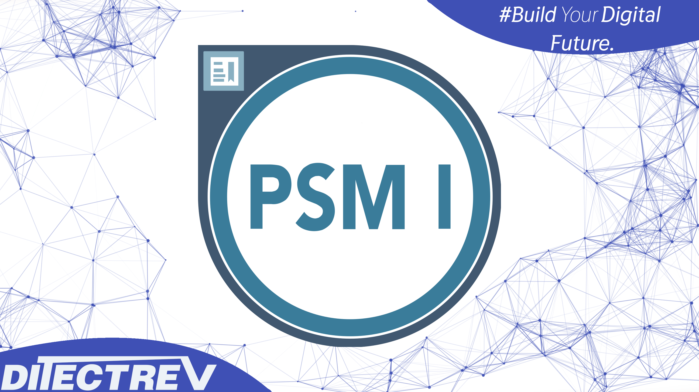

# ⬆️ Scrum Master I for PSM I Practice Tests Exams Questions & Answers

## ❣ Support

There are many ways to support us; in exchange, you'll get this material in a proper format:
- ❤️ [shop.ditectrev.com, in EPUB or PDF formats, with answers marked](https://shop.ditectrev.com/product/scrum-master-i-for-psm-i-practice-tests-exams-questions-answers),
- ❤️ [shop.ditectrev.com, in EPUB or PDF formats, without answers marked](https://shop.ditectrev.com/product/scrum-master-i-for-psm-i-practice-tests-exams-questions-no-answers),
- 📖 [Udemy is the only one to have explanations for questions](https://www.udemy.com/course/professional-scrum-master-i-psm-i-practice-tests-exams/?referralCode=AE50158A452A3EAB8A7E),
- 📚 [Google Play Books, in PDF format, with answers marked](https://play.google.com/store/books/details?id=VaUSEQAAQBAJ),
- 📚 [Google Play Books, in PDF format, without answers marked](https://play.google.com/store/books/details?id=U6USEQAAQBAJ),
- 🛍️ [Etsy, in PDF format, with answers marked](https://ditectrev.etsy.com/listing/1429943635),
- 🛍️ [Etsy, in PDF format, without answers marked](https://ditectrev.etsy.com/listing/1534080175),
- 🛒 [eBay, in PDF format, with answers marked](https://www.ebay.com/itm/405227116399?mkcid=16&mkevt=1&mkrid=711-127632-2357-0&ssspo=_ptbuk3gqdw&sssrc=2524149&ssuid=_ptbuk3gqdw&widget_ver=artemis&media=COPY),
- 🛒 [eBay, in PDF format, without answers marked](https://www.ebay.com/itm/405227116397?mkcid=16&mkevt=1&mkrid=711-127632-2357-0&ssspo=_ptbuk3gqdw&sssrc=2524149&ssuid=_ptbuk3gqdw&widget_ver=artemis&media=COPY),
- 🔄 [Patreon subscription allows you to get access to all of the materials in EPUB and PDF formats. You can also buy separate items on Patreon, but the subscription technically allows us to include all updates for EPUB and PDF formats. Hence, you get EPUB and PDF updates when you subscribe to Patreon](https://patreon.com/Ditectrev?utm_medium=unknown&utm_source=join_link&utm_campaign=creatorshare_creator&utm_content=copyLink).

💰 If you work for a company, you could probably easily claim this expense while preparing for your exam. For us, it's about being in the game or not.

⭐ Good ratings & reviews help us to survive. Please don't forget to leave a nice one when you purchase an item. 

## ✨ This course is unlike any Scrum Master I for PSM I course you will find online.

✋ Join a live online community and a course taught by industry experts and pass the Scrum Master I (PSM I) confidently. We aim to build an ecosystem of Information Technology (IT) certifications and online courses in cooperation with the technology industry. We believe it will give our students 100% confidence in the pacing market in an open-source environment. We are just at the beginning of our way, so it's even better for you to join now!

## ⌛️ Short and to the point; why should you take the course:

1. Always happy to answer your questions on Udemy's Q&A's and outside :)
2. Failed? Please submit a screenshot of your exam result and request a refund (via our upcoming platform, not possible on Udemy); we'll always accept it.
3. Learn about topics, such as:
   - Definition of Done (DoD);
   - Development Team;
   - Product Backlog;
   - Scrum;
   - Scrum Daily;
   - Scrum Team;
   - Scrum Value;
   - Sprint Backlog;
   - Sprint Goal;
   - Sprint Planning;
   - Sprint Retrospective;
   - Sprint Review;
   - **Much More!**
4. Questions are similar to the actual exam, without duplications (like in other courses ;-)).
5. The Practice Tests Exams simulate the actual exam's content, timing, and percentage required to pass the exam.
6. This course is **not** a Scrum Master I (PSM I) Exam Dump. Some people use brain dumps or exam dumps, but that's absurd, which we don't practice.
7. 245 **unique** questions.

## ☝️ Course Updates

**[v1.0.0](../../releases/tag/v1.0.0): February 15, 2023.**

- Launch of the course.

**[v1.1.0](../../releases/tag/v1.1.0): May 23, 2023.**

- Fix 15 wrong answers, delete 2 questions, and make other minor improvements.

**[v1.1.1](../../releases/tag/v1.1.1): September 21, 2023.**

- Delete 1 duplicated question, and 2 typos improvements.

**[v1.1.2](../../releases/tag/v1.1.2): November 11, 2023.**

- Fix all remaining typos with support of automated proofreading software and 1 wrong answer.

**[v1.1.3](../../releases/tag/v1.1.3): January 24, 2024.**

- Fix minor typos and 1 question with wrong answer.

**[v1.1.4](../../releases/tag/v1.1.4): March 2, 2024.**

- Fix minor typos and 1 question with wrong answer.

**[v1.1.4](../../releases/tag/v1.1.4): August 7, 2024.**

- AI-generated explanations (only paid [Udemy](https://www.udemy.com/course/professional-scrum-master-i-psm-i-practice-tests-exams/?referralCode=AE50158A452A3EAB8A7E)).

## 🙋‍♀️ & 🙋‍♂️ Contribution

We are so thankful for every contribution, which makes sure we can deliver top-notch content. Whenever you find a missing resource, broken link in a [Table of Contents](../..#table-of-contents), the wrong answer, please submit an [issue](../../issues). Even better would be a [Pull Request (PR)](../../pulls).

## Who this course is for:

- 👨‍🎓 Students preparing for the Scrum Master I (PSM I) Exam;
- 👨‍🎓 Agile Coaches;
- 👨‍🎓 Agile Leaders;
- 👨‍🎓 DevOps Engineers;
- 👨‍🎓 IT Professionals;
- 👨‍🎓 Lead Engineers;
- 👨‍🎓 Scrum Masters;
- 👨‍🎓 Software Developers/Engineers;
- 👨‍🎓 Software Testers;
- 👨‍🎓 Product Managers;
- 👨‍🎓 Product Owners;
- 👨‍🎓 Project Managers;
- 👨‍🎓 Team Leaders.

## Requirements

- 🤩 Excitement to learn!
- 0️⃣ Prior knowledge is required;
- ✅ You can pass the Scrum Master I (PSM I) Exam solely based on our Practice Tests Exams.

## Table of Contents

| No. | Questions |
| --- | --------------------------- |
| 1   | [You have just been hired by a company new to Scrum. Your management has assigned you to be the Scrum Master of six new Scrum Teams. These teams will build one product. Select two conditions you should strive for in this scenario. (choose two)](#you-have-just-been-hired-by-a-company-new-to-scrum-your-management-has-assigned-you-to-be-the-scrum-master-of-six-new-scrum-teams-these-teams-will-build-one-product-select-two-conditions-you-should-strive-for-in-this-scenario-choose-two) |
| 2   | [A Scrum Team has been working on a product for nine Sprints. A new Product Owner comes in, understanding he is accountable for the Product Backlog. However, he is unsure about his responsibilities. Which two activities are part of the Product Owner role according to Scrum? (choose two)](#a-scrum-team-has-been-working-on-a-product-for-nine-sprints-a-new-product-owner-comes-in-understanding-he-is-accountable-for-the-product-backlog-however-he-is-unsure-about-his-responsibilities-which-two-activities-are-part-of-the-product-owner-role-according-to-scrum-choose-two) |
| 3   | [User documentation is part of your definition of "Done". However, there aren't enough technical writers for all teams. Your Development Team doesn't have a technical writer. What should you do?](#user-documentation-is-part-of-your-definition-of-done-however-there-arent-enough-technical-writers-for-all-teams-your-development-team-doesnt-have-a-technical-writer-what-should-you-do) |
| 4   | [You are the Scrum Master for four Scrum Teams working from the same Product Backlog. Several of the developers come to you complaining that work identified for the upcoming two Sprints will require full-time commitment from a technical specialist who is external to the teams. What are two key concerns for the Scrum Master to take into account in this situation? (choose two)](#you-are-the-scrum-master-for-four-scrum-teams-working-from-the-same-product-backlog-several-of-the-developers-come-to-you-complaining-that-work-identified-for-the-upcoming-two-sprints-will-require-full-time-commitment-from-a-technical-specialist-who-is-external-to-the-teams-what-are-two-key-concerns-for-the-scrum-master-to-take-into-account-in-this-situation-choose-two) |
| 5   | [The Product Backlog is ordered by:](#the-product-backlog-is-ordered-by) |
| 6   | [What happens if the Development Team cannot complete its work by the end of the Sprint?](#what-happens-if-the-development-team-cannot-complete-its-work-by-the-end-of-the-sprint) |
| 7   | [Which topics should be discussed in the Sprint Review?](#which-topics-should-be-discussed-in-the-sprint-review) |
| 8   | [A member of the Development Team takes the Scrum Master aside to express his concerns about data security issues. What should the Scrum Master do?](#a-member-of-the-development-team-takes-the-scrum-master-aside-to-express-his-concerns-about-data-security-issues-what-should-the-scrum-master-do) |
| 9   | [What does it mean for a Development Team to be cross-functional?](#what-does-it-mean-for-a-development-team-to-be-cross-functional) |
| 10  | [Sprint burndown charts are an efficient tracking tool, because they show:](#sprint-burndown-charts-are-an-efficient-tracking-tool-because-they-show)   |
| 11  | [How much work must a Development Team do to a Product Backlog item it selects for a Sprint?](#how-much-work-must-a-development-team-do-to-a-product-backlog-item-it-selects-for-a-sprint)   |
| 12  | [Which statement best describes the Sprint Backlog as outcome of the Sprint Planning?](#which-statement-best-describes-the-sprint-backlog-as-outcome-of-the-sprint-planning)   |
| 13  | [If burndown charts are used to visualize progress, what does a trend line through a release burndown chart indicate? (choose the best answer)](#if-burndown-charts-are-used-to-visualize-progress-what-does-a-trend-line-through-a-release-burndown-chart-indicate-choose-the-best-answer)   |
| 14  | [Who is responsible for engaging the stakeholders?](#who-is-responsible-for-engaging-the-stakeholders-choose-the-best-answer)   |
| 15  | [At the end of a Sprint Product Backlog item worked on during the Sprint does not meet the definition of "Done". What two things should happen with the undone Product Backlog item?](#at-the-end-of-a-sprint-product-backlog-item-worked-on-during-the-sprint-does-not-meet-the-definition-of-done-what-two-things-should-happen-with-the-undone-product-backlog-item-choose-the-best-two-answers)   |
| 16  | [Which two of the following are true about the Scrum Master role?](#which-two-of-the-following-are-true-about-the-scrum-master-role-choose-the-best-two-answers)   |
| 17  | [What are three benefits of self-organization?](#what-are-three-benefits-of-self-organization-choose-the-best-three-answers)   |
| 18  | [Which three of the following are time-boxed events in Scrum?](#which-three-of-the-following-are-time-boxed-events-in-scrum-choose-the-best-three-answers)   |
| 19  | [Who is responsible for clearly expressing Product Backlog items?](#who-is-responsible-for-clearly-expressing-product-backlog-items-choose-the-best-answer)   |
| 20  | [What is the best suited structure for Development Teams in order to produce integrated Increments?](#what-is-the-best-suited-structure-for-development-teams-in-order-to-produce-integrated-increments-choose-the-best-answer)   |
| 21  | [Why should the Product Owner be present at the Daily Scrum?](#why-should-the-product-owner-be-present-at-the-daily-scrum-choose-the-best-answer)   |
| 22  | [What two techniques could the Scrum Master use when the Scrum Team gets caught in an internal disagreement about which development techniques to apply?](#what-two-techniques-could-the-scrum-master-use-when-the-scrum-team-gets-caught-in-an-internal-disagreement-about-which-development-techniques-to-apply-choose-the-best-two-answers)   |
| 23  | [What enhances the transparency of an increment?](#what-enhances-the-transparency-of-an-increment-choose-the-best-answer)   |
| 24  | [Who determines how work is performed during the Sprint?](#who-determines-how-work-is-performed-during-the-sprint-choose-the-best-answer)   |
| 25  | [When does the second Sprint start?](#when-does-the-second-sprint-start-choose-the-best-answer)   |
| 26  | [What is included in the Sprint Backlog?](#what-is-included-in-the-sprint-backlog-choose-the-best-answer)   |
| 27  | [Which of the following are true about the Product Owner role?](#which-of-the-following-are-true-about-the-product-owner-role-choose-the-best-two-answers)   |
| 28  | [True or False: When multiple teams work together on the same product, each team should maintain a separate Product Backlog.](#true-or-false-when-multiple-teams-work-together-on-the-same-product-each-team-should-maintain-a-separate-product-backlog)   |
| 29  | [If two Scrum Teams are added to the development of a product that previously had only one Scrum Team, what will be the immediate impact on the productivity of the original Scrum Team?](#if-two-scrum-teams-are-added-to-the-development-of-a-product-that-previously-had-only-one-scrum-team-what-will-be-the-immediate-impact-on-the-productivity-of-the-original-scrum-team-choose-the-best-answer)   |
| 30  | [A Scrum Master is introducing Scrum to a new Development Team. The Development Team has decided that a Sprint Retrospective is unnecessary. What action should the Scrum Master take?](#a-scrum-master-is-introducing-scrum-to-a-new-development-team-the-development-team-has-decided-that-a-sprint-retrospective-is-unnecessary-what-action-should-the-scrum-master-take-choose-the-best-answer)   |
| 31  | [Which two things are appropriate for a Scrum Master to do if the Development Team doesn't have the engineering tools and infrastructure to completely finish each selected Product Backlog item?](#which-two-things-are-appropriate-for-a-scrum-master-to-do-if-the-development-team-doesnt-have-the-engineering-tools-and-infrastructure-to-completely-finish-each-selected-product-backlog-item-choose-the-best-two-answers)   |
| 32  | [When is implementation of a Product Backlog item considered complete?](#when-is-implementation-of-a-product-backlog-item-considered-complete-choose-the-best-answer)   |
| 33  | [Choose two responsibilities of a self-organizing Development Team. (choose the best two answers)](#choose-two-responsibilities-of-a-self-organizing-development-team-choose-the-best-two-answers)   |
| 34  | [Every Development Team should have: (choose the best answer)](#every-development-team-should-have-choose-the-best-answer)   |
| 35  | [Why does the Product Owner want the Development Team to adhere to its definition of "Done"?](#why-does-the-product-owner-want-the-development-team-to-adhere-to-its-definition-of-done-choose-the-best-answer)   |
| 36  | [During a Sprint Retrospective, for what is the Scrum Master responsible? (choose the best answer)](#during-a-sprint-retrospective-for-what-is-the-scrum-master-responsible-choose-the-best-answer)   |
| 37  | [The Development Team should have all the skills needed to: (choose the best answer)](#the-development-team-should-have-all-the-skills-needed-to-choose-the-best-answer)   |
| 38  | [What is the Scrum Master responsible?](#what-is-the-scrum-master-responsible)   |
| 39  | [The Scrum Master observes the Product Owner struggling with ordering the Product Backlog. What is an appropriate action for the Scrum Master to take? (choose the best answer)](#the-scrum-master-observes-the-product-owner-struggling-with-ordering-the-product-backlog-what-is-an-appropriate-action-for-the-scrum-master-to-take-choose-the-best-answer)   |
| 40  | [True or False: The Product Owner makes sure the team selects enough from the Product Backlog for a Sprint to satisfy the stakeholders.](#true-or-false-the-product-owner-makes-sure-the-team-selects-enough-from-the-product-backlog-for-a-sprint-to-satisfy-the-stakeholders)   |
| 41  | [Which statement best describes the Sprint Review?](#which-statement-best-describes-the-sprint-review-choose-the-best-answer)   |
| 42  | [Who owns the Sprint Backlog?](#who-owns-the-sprint-backlog-choose-the-best-answer)   |
| 43  | [When might a Sprint be abnormally cancelled?](#when-might-a-sprint-be-abnormally-cancelled-choose-the-best-answer)   |
| 44  | [A Sprint Retrospective should be held: (choose the best answer)](#a-sprint-retrospective-should-be-held-choose-the-best-answer)   |
| 45  | [A new developer is having continuing conflicts with existing Development Team members and creating the hostile environment. If necessary, who is responsible for removing the team member?](#a-new-developer-is-having-continuing-conflicts-with-existing-development-team-members-and-creating-the-hostile-environment-if-necessary-who-is-responsible-for-removing-the-team-member-choose-the-best-answer)   |
| 46  | [Which three purposes does the definition of "Done" serve?](#which-three-purposes-does-the-definition-of-done-serve-choose-the-best-three-answers)   |
| 47  | [During a Sprint Retrospective, the Development Team proposes moving the Daily Scrum to only occur on Tuesdays and Thursdays. Which two are the most appropriate responses for the Scrum Master? (choose the best two answers)](#during-a-sprint-retrospective-the-development-team-proposes-moving-the-daily-scrum-to-only-occur-on-tuesdays-and-thursdays-which-two-are-the-most-appropriate-responses-for-the-scrum-master-choose-the-best-two-answers)   |
| 48  | [When should a Sprint Goal be created?](#when-should-a-sprint-goal-be-created-choose-the-best-answer)   |
| 49  | [True or False: Every Scrum team must have a Product Owner and Scrum Master.](#true-or-false-every-scrum-team-must-have-a-product-owner-and-scrum-master)   |
| 50  | [Who can abnormally terminate a Sprint?](#who-can-abnormally-terminate-a-sprint-choose-the-best-answer)   |
| 51  | [True or False: The Sprint Goal is a result of Sprint Planning, as is the Sprint Backlog.](#true-or-false-the-sprint-goal-is-a-result-of-sprint-planning-as-is-the-sprint-backlog)   |
| 52  | [Which two of the following are appropriate topics for discussion during a Sprint Retrospective?](#which-two-of-the-following-are-appropriate-topics-for-discussion-during-a-sprint-retrospective-choose-the-best-two-answers)   |
| 53  | [A Scrum Master is working with a Development Team that has members in different physical locations. The Development Team meets in a variety of meeting rooms and has much to do logistically (for example, set up conference calls) before the Daily Scrum. What action should the Scrum Master take?](#a-scrum-master-is-working-with-a-development-team-that-has-members-in-different-physical-locations-the-development-team-meets-in-a-variety-of-meeting-rooms-and-has-much-to-do-logistically-for-example-set-up-conference-calls-before-the-daily-scrum-what-action-should-the-scrum-master-take-choose-the-best-answer)   |
| 54  | [True or False: Cross-functional teams are optimized to work on one technical layer of a system only (e.g. GUI, database, middle tier, interfaces).](#true-or-false-cross-functional-teams-are-optimized-to-work-on-one-technical-layer-of-a-system-only-eg-gui-database-middle-tier-interfaces)   |
| 55  | [Which of the following might the Scrum Team discuss during a Sprint Retrospective?](#which-of-the-following-might-the-scrum-team-discuss-during-a-sprint-retrospective-choose-the-best-answer)   |
| 56  | [What are the two primary ways a Scrum Master keeps a Development Team working at its highest level of productivity?](#what-are-the-two-primary-ways-a-scrum-master-keeps-a-development-team-working-at-its-highest-level-of-productivity-choose-the-best-two-answers)   |
| 57  | [What is the recommended size for a Development Team?](#what-is-the-recommended-size-for-a-development-team-choose-the-best-answer)   |
| 58  | [You are the Scrum Master of a new, to be developed product. Development is going to require 45 people. What is a good first question-for you to suggest the group thinks about when forming into teams?](#you-are-the-scrum-master-of-a-new-to-be-developed-product-development-is-going-to-require-45-people-what-is-a-good-first-question-for-you-to-suggest-the-group-thinks-about-when-forming-into-teams-choose-the-best-answer)   |
| 59  | [Which three of the following are feedback loops in Scrum?](#which-three-of-the-following-are-feedback-loops-in-scrum-choose-the-best-three-answers)   |
| 60  | [When a Development Team is having trouble delivering a working Increment because they don't understand a functional requirement, what should they do?](#when-a-development-team-is-having-trouble-delivering-a-working-increment-because-they-dont-understand-a-functional-requirement-what-should-they-do-choose-the-best-answer)   |
| 61  | [When is the Sprint Backlog created?](#when-is-the-sprint-backlog-created-choose-the-best-answer)   |
| 62  | [Which of the following services are appropriate for a Scrum Master in regard to the Daily Scrum?](#which-of-the-following-services-are-appropriate-for-a-scrum-master-in-regard-to-the-daily-scrum-choose-the-best-answer)   |
| 63  | [Which of the following best describes an increment of working software?](#which-of-the-following-best-describes-an-increment-of-working-software-choose-the-best-answer)   |
| 64  | [In order to achieve the benefits of Scrum, it is important to enact the value of commitment. What two actions demonstrate the commitment of Scrum Team members?](#in-order-to-achieve-the-benefits-of-scrum-it-is-important-to-enact-the-value-of-commitment-what-two-actions-demonstrate-the-commitment-of-scrum-team-members-choose-the-best-two-answers)   |
| 65  | [The Product Owner determines how many Product Backlog items the Development Team selects for a Sprint. (choose the best answer)](#the-product-owner-determines-how-many-product-backlog-items-the-development-team-selects-for-a-sprint-choose-the-best-answer)   |
| 66  | [PLACEHOLDER 1](#placeholder-1)   |
| 67  | [The Sprint Review is mainly an inspect and adapt opportunity for which group?](#the-sprint-review-is-mainly-an-inspect-and-adapt-opportunity-for-which-group)   |
| 68  | [To get started in terms of what to build, Scrum requires no more than a Product Owner with enough ideas for a first Sprint, a Development Team to implement those ideas and a Scrum Master to help guide the process.](#to-get-started-in-terms-of-what-to-build-scrum-requires-no-more-than-a-product-owner-with-enough-ideas-for-a-first-sprint-a-development-team-to-implement-those-ideas-and-a-scrum-master-to-help-guide-the-process)   |
| 69  | [What is the time-box for the Sprint Review?](#what-is-the-time-box-for-the-sprint-review)   |
| 70  | [Who is responsible for tracking the remaining work of the Sprint?](#who-is-responsible-for-tracking-the-remaining-work-of-the-sprint)   |
| 71  | [What is the tactic a Scrum Master should use to divide a group of 100 people into multiple Development Teams?](#what-is-the-tactic-a-scrum-master-should-use-to-divide-a-group-of-100-people-into-multiple-development-teams)   |
| 72  | [A product Increment must be released to production at the end of each Sprint.](#a-product-increment-must-be-released-to-production-at-the-end-of-each-sprint)   |
| 73  | [If burndown charts are used to visualize progress, what do they track?](#if-burndown-charts-are-used-to-visualize-progress-what-do-they-track)   |
| 74  | [How is management external to the Scrum Team involved in the Daily Scrum?](#how-is-management-external-to-the-scrum-team-involved-in-the-daily-scrum)   |
| 75  | [A Scrum Master is keeping a list of open impediments, but it is growing and he/she has been able to resolve only a small portion of the impediments. Which three techniques would be most helpful in this situation? (choose three)](#a-scrum-master-is-keeping-a-list-of-open-impediments-but-it-is-growing-and-heshe-has-been-able-to-resolve-only-a-small-portion-of-the-impediments-which-three-techniques-would-be-most-helpful-in-this-situation-choose-three)   |
| 76  | [Which Scrum Value is affected by a lack of trust in the Scrum Team?](#which-scrum-value-is-affected-by-a-lack-of-trust-in-the-scrum-team)   |
| 77  | [What is the time-box for the Sprint Planning meeting?](#what-is-the-time-box-for-the-sprint-planning-meeting)   |
| 78  | [A Product Owner wants advice from the Scrum Master about estimating work in Scrum. Which of these is the guideline that a Scrum Master should give?](#a-product-owner-wants-advice-from-the-scrum-master-about-estimating-work-in-scrum-which-of-these-is-the-guideline-that-a-scrum-master-should-give)   |
| 79  | [What is a Development Team responsible for? (choose two)](#what-is-a-development-team-responsible-for-choose-two)   |
| 80  | [Which two ways of creating Development Teams are consistent with Scrum's values? (choose two)](#which-two-ways-of-creating-development-teams-are-consistent-with-scrums-values-choose-two)   |
| 81  | [A Scrum Master is essentially the same thing as a traditional PM (Project Manager).](#a-scrum-master-is-essentially-the-same-thing-as-a-traditional-pm-project-manager)   |
| 82  | [The Product Owner is not collaborating with the Development Team during the Sprint. What are two valuable actions for a Scrum Master to take? (choose two)](#the-product-owner-is-not-collaborating-with-the-development-team-during-the-sprint-what-are-two-valuable-actions-for-a-scrum-master-to-take-choose-two)   |
| 83  | [True or False: Multiple Scrum Teams working on the same product or system all select work from the same Product Backlog.](#true-or-false-multiple-scrum-teams-working-on-the-same-product-or-system-all-select-work-from-the-same-product-backlog)   |
| 84  | [For the purpose of transparency, when does Scrum say a new increment of working software must be available?](#for-the-purpose-of-transparency-when-does-scrum-say-a-new-increment-of-working-software-must-be-available)   |
| 85  | [Multiple Scrum Teams working on the same project must have the same Sprint start date.](#multiple-scrum-teams-working-on-the-same-project-must-have-the-same-sprint-start-date)   |
| 86  | [During a Sprint Retrospective, for what is the Product Owner responsible?](#during-a-sprint-retrospective-for-what-is-the-product-owner-responsible)   |
| 87  | [Marian is the Product Owner envisioning a project for a new release of her product. She made a projection of a release date based upon a sustained velocity of 17 completed units of work per Sprint. Over the first 3 Sprints, the average velocity was 13 for work that the Development Team estimated as 90% done. The Development Teams, feeling the need to meet the plan, figured that a velocity of 17 was within their reach. A good way to continue is:](#marian-is-the-product-owner-envisioning-a-project-for-a-new-release-of-her-product-she-made-a-projection-of-a-release-date-based-upon-a-sustained-velocity-of-17-completed-units-of-work-per-sprint-over-the-first-3-sprints-the-average-velocity-was-13-for-work-that-the-development-team-estimated-as-90-done-the-development-teams-feeling-the-need-to-meet-the-plan-figured-that-a-velocity-of-17-was-within-their-reach-a-good-way-to-continue-is)   |
| 88  | [The time-box for a Daily Scrum?](#the-time-box-for-a-daily-scrum)   |
| 89  | [Which phrase best describes a Product Owner?](#which-phrase-best-describes-a-product-owner)   |
| 90  | [The length of a Sprint should be:](#the-length-of-a-sprint-should-be)   |
| 91  | [What are two responsibilities of testers in a Development Team? (choose two)](#what-are-two-responsibilities-of-testers-in-a-development-team-choose-two)   |
| 92  | [The CEO asks the Development Team to add a "very important" item to a Sprint that is in progress. What should the Development Team do?](#the-ceo-asks-the-development-team-to-add-a-very-important-item-to-a-sprint-that-is-in-progress-what-should-the-development-team-do)   |
| 93  | [What is the role of management in Scrum?](#what-is-the-role-of-management-in-scrum)   |
| 94  | [Which technique is the best way the Scrum Master can ensure that the Development Team communicates effectively with the Product Owner?](#which-technique-is-the-best-way-the-scrum-master-can-ensure-that-the-development-team-communicates-effectively-with-the-product-owner)   |
| 95  | [How much of the Sprint Backlog must be defined during the Sprint Planning event?](#how-much-of-the-sprint-backlog-must-be-defined-during-the-sprint-planning-event) |
| 96  | [Who is responsible for managing the progress of work during a Sprint?](#who-is-responsible-for-managing-the-progress-of-work-during-a-sprint) |
| 97  | [PLACEHOLDER 2](#placeholder-2) |
| 98  | [What two factors are best considered when establishing the Sprint length? (choose two.)](#what-two-factors-are-best-considered-when-establishing-the-sprint-length-choose-two) |
| 99  | [Which of these may a Development Team deliver at the end of a Sprint?](#which-of-these-may-a-development-team-deliver-at-the-end-of-a-sprint) |
| 100 | [Who creates a Product Backlog item's estimate?](#who-creates-a-product-backlog-items-estimate) |
| 101 | [Who starts the Daily Scrum?](#who-starts-the-daily-scrum) |
| 102 | [You are the Scrum Master on a newly formed Scrum Team. Which three of the following activities would probably help the team in starting up? (choose three)](#you-are-the-scrum-master-on-a-newly-formed-scrum-team-which-three-of-the-following-activities-would-probably-help-the-team-in-starting-up-choose-three) |
| 103 | [A Development Team selects a set of Product Backlog items for a Sprint Backlog with the intent to get the selected items "Done" by the end of the Sprint. Which three phrases best describe the purpose of a definition of "Done"? (choose three)](#a-development-team-selects-a-set-of-product-backlog-items-for-a-sprint-backlog-with-the-intent-to-get-the-selected-items-done-by-the-end-of-the-sprint-which-three-phrases-best-describe-the-purpose-of-a-definition-of-done-choose-three) |
| 104 | [The Daily Scrum is an event that happens every day. What would be three key concerns if the frequency were to be lowered to every two or three days? (choose three)](#the-daily-scrum-is-an-event-that-happens-every-day-what-would-be-three-key-concerns-if-the-frequency-were-to-be-lowered-to-every-two-or-three-days-choose-three) |
| 105 | [Which statement best describes Scrum?](#which-statement-best-describes-scrum) |
| 106 | [Which Scrum Values are exhibited by not building Product Backlog items that have low business value? (choose three)](#which-scrum-values-are-exhibited-by-not-building-product-backlog-items-that-have-low-business-value-choose-three) |
| 107 | [How should Product Backlog items be chosen when multiple Scrum Teams work from the same Product Backlog?](#how-should-product-backlog-items-be-chosen-when-multiple-scrum-teams-work-from-the-same-product-backlog) |
| 108 | [How often should Development Team membership change?](#how-often-should-development-team-membership-change) |
| 109 | [Who should make sure everyone on the Development Team does his or her tasks for the Sprint?](#who-should-make-sure-everyone-on-the-development-team-does-his-or-her-tasks-for-the-sprint) |
| 110 | [When is it most appropriate for a Development Team to change the definition of "Done"?](#when-is-it-most-appropriate-for-a-development-team-to-change-the-definition-of-done) |
| 111 | [As the Sprint Planning meeting progresses, the Development Team sees that the workload is greater than they can handle. Which two are valid actions? (choose two)](#as-the-sprint-planning-meeting-progresses-the-development-team-sees-that-the-workload-is-greater-than-they-can-handle-which-two-are-valid-actions-choose-two) |
| 112 | [Currently, your Development Teams are organized to address a single layer only (for example, front end, middle tier, back end, and interfaces). What are three things to consider when deciding to move away from such component teams toward feature teams? (choose three)](#currently-your-development-teams-are-organized-to-address-a-single-layer-only-for-example-front-end-middle-tier-back-end-and-interfaces-what-are-three-things-to-consider-when-deciding-to-move-away-from-such-component-teams-toward-feature-teams-choose-three) |
| 113 | [During a Sprint, when is new work or further decomposition of work added to the Sprint Backlog?](#during-a-sprint-when-is-new-work-or-further-decomposition-of-work-added-to-the-sprint-backlog) |
| 114 | [What is the main reason for the Scrum Master to be at the Daily Scrum?](#what-is-the-main-reason-for-the-scrum-master-to-be-at-the-daily-scrum) |
| 115 | [You have six teams using a traditional method to deliver a product. Your management has asked you to start using Scrum. In the initial project there were separate plans and teams for the layers of a software system, i.e. one for the frontend, one for the middle tier, one for the back-end, and one for the interfaces and services. This resembles what is known as component teams. But you have read that it's a good idea to have teams organized by feature. What are the advantages of keeping component teams while starting Scrum?](#you-have-six-teams-using-a-traditional-method-to-deliver-a-product-your-management-has-asked-you-to-start-using-scrum-in-the-initial-project-there-were-separate-plans-and-teams-for-the-layers-of-a-software-system-ie-one-for-the-frontend-one-for-the-middle-tier-one-for-the-back-end-and-one-for-the-interfaces-and-services-this-resembles-what-is-known-as-component-teams-but-you-have-read-that-its-a-good-idea-to-have-teams-organized-by-feature-what-are-the-advantages-of-keeping-component-teams-while-starting-scrum) |
| 116 | [True or False: A properly functioning Scrum Team will have at least one Release Sprint and may well have several.](#true-or-false-a-properly-functioning-scrum-team-will-have-at-least-one-release-sprint-and-may-well-have-several) |
| 117 | [Scrum is a methodology that tells in detail how to build software incrementally.](#scrum-is-a-methodology-that-tells-in-detail-how-to-build-software-incrementally) |
| 118 | [For which is the Scrum Master responsible?](#for-which-is-the-scrum-master-responsible) |
| 119 | [A Development Team asks their Product Owner to re-order the Product Backlog. The team is waiting for an external supplier to deliver a specific software component. Without that component there won't be enough work in the next Sprint to occupy the full team. The Product Owner asks the Scrum Master for help. What would be good advice to give the Product Owner?](#a-development-team-asks-their-product-owner-to-re-order-the-product-backlog-the-team-is-waiting-for-an-external-supplier-to-deliver-a-specific-software-component-without-that-component-there-wont-be-enough-work-in-the-next-sprint-to-occupy-the-full-team-the-product-owner-asks-the-scrum-master-for-help-what-would-be-good-advice-to-give-the-product-owner) |
| 120 | [What are three ways Scrum promotes self-organization? (choose three)](#what-are-three-ways-scrum-promotes-self-organization-choose-three) |
| 121 | [What is the key concern when multiple Development Teams are working from the same Product Backlog?](#what-is-the-key-concern-when-multiple-development-teams-are-working-from-the-same-product-backlog) |
| 122 | [What does it mean to say that an event has a time-box?](#what-does-it-mean-to-say-that-an-event-has-a-time-box) |
| 123 | [Which outcome is expected as Scrum Teams mature?](#which-outcome-is-expected-as-scrum-teams-mature) |
| 124 | [The Product Owner must release each Increment to production.](#the-product-owner-must-release-each-increment-to-production) |
| 125 | [Who creates the definition of "Done"?](#who-creates-the-definition-of-done) |
| 126 | [Five new Scrum Teams have been created to build one product. A few of the developers on one of the Development Teams ask the Scrum Master how to coordinate their work with the order teams. What should the Scrum Master do?](#five-new-scrum-teams-have-been-created-to-build-one-product-a-few-of-the-developers-on-one-of-the-development-teams-ask-the-scrum-master-how-to-coordinate-their-work-with-the-order-teams-what-should-the-scrum-master-do) |
| 127 | [Which two things should the Development Team do during the first Sprint? (choose two)](#which-two-things-should-the-development-team-do-during-the-first-sprint-choose-two) |
| 128 | [Who determines when it is appropriate to update the Sprint Backlog during a Sprint?](#who-determines-when-it-is-appropriate-to-update-the-sprint-backlog-during-a-sprint) |
| 129 | [Who must attend the Daily Scrum?](#who-must-attend-the-daily-scrum) |
| 130 | [When do Development Team members take ownership of a Sprint Backlog item?](#when-do-development-team-members-take-ownership-of-a-sprint-backlog-item) |
| 131 | [The purpose of a Sprint is to produce a done Increment of product.](#the-purpose-of-a-sprint-is-to-produce-a-done-increment-of-product) |
| 132 | [In the Sprint Planning meeting, the Product Owner and the Development Team were unable to reach a clear understanding about the highest order Product Backlog items. Because of this, the Development Team couldn't figure out how many Product Backlog items it could forecast for the upcoming Sprint. They were able to agree on a Sprint Goal, however. Which of the following two actions should the Scrum Master support? (choose two)](#in-the-sprint-planning-meeting-the-product-owner-and-the-development-team-were-unable-to-reach-a-clear-understanding-about-the-highest-order-product-backlog-items-because-of-this-the-development-team-couldnt-figure-out-how-many-product-backlog-items-it-could-forecast-for-the-upcoming-sprint-they-were-able-to-agree-on-a-sprint-goal-however-which-of-the-following-two-actions-should-the-scrum-master-support-choose-two) |
| 133 | [Which answer best describes the topics covered in Sprint Planning?](#which-answer-best-describes-the-topics-covered-in-sprint-planning) |
| 134 | [Which of the following is required by Scrum? (choose all that apply)](#which-of-the-following-is-required-by-scrum-choose-all-that-apply) |
| 135 | [What is the purpose of a Sprint Review?](#what-is-the-purpose-of-a-sprint-review) |
| 136 | [How should a Development Team deal with non-functional requirements?](#how-should-a-development-team-deal-with-non-functional-requirements) |
| 137 | [When is a Sprint over?](#when-is-a-sprint-over) |
| 138 | [Scrum has a role called "Project Manager".](#scrum-has-a-role-called-project-manager) |
| 139 | [Where are two good ways for the Development Team to make non-functional requirements visible? (choose two)](#where-are-two-good-ways-for-the-development-team-to-make-non-functional-requirements-visible-choose-two) |
| 140 | [How much time is required after a Sprint to prepare for the next Sprint?](#how-much-time-is-required-after-a-sprint-to-prepare-for-the-next-sprint) |
| 141 | [When many Scrum Teams are working on the same product, should all of their increments be integrated every Sprint?](#when-many-scrum-teams-are-working-on-the-same-product-should-all-of-their-increments-be-integrated-every-sprint) |
| 142 | [When can a Development Team cancel a Sprint?](#when-can-a-development-team-cancel-a-sprint) |
| 143 | [Which output from Sprint Planning provides the Development Team with a target and overarching direction for the Sprint?](#which-output-from-sprint-planning-provides-the-development-team-with-a-target-and-overarching-direction-for-the-sprint) |
| 144 | [During the Sprint Retrospective a Scrum Team has identified several high priority process improvements. Which of the following statements is most accurate? (choose the best answer)](#during-the-sprint-retrospective-a-scrum-team-has-identified-several-high-priority-process-improvements-which-of-the-following-statements-is-most-accurate-choose-the-best-answer) |
| 145 | [What techniques could the Scrum Master use when the Scrum Team gets caught in an internal disagreement about which agile practices to apply? (choose the best two answers)](#what-techniques-could-the-scrum-master-use-when-the-scrum-team-gets-caught-in-an-internal-disagreement-about-which-agile-practices-to-apply-choose-the-best-two-answers) |
| 146 | [Who is accountable for clearly expressing Product Backlog items? (choose the best answer)](#who-is-accountable-for-clearly-expressing-product-backlog-items-choose-the-best-answer) |
| 147 | [When many Scrum Teams are working on a single product, what best describes the Definition of Done? (choose the best answer)](#when-many-scrum-teams-are-working-on-a-single-product-what-best-describes-the-definition-of-done-choose-the-best-answer) |
| 148 | [When many Development Teams are working on a single product, what best describes the definition of "Done"? (choose the best answer)](#when-many-development-teams-are-working-on-a-single-product-what-best-describes-the-definition-of-done-choose-the-best-answer) |
| 149 | [At the seventh Sprint Review, the stakeholders are disappointed and angry. They have determined that the product or system being built will not meet their needs and will cost more than they are willing to spend. What factors likely led to this? (choose two)](#at-the-seventh-sprint-review-the-stakeholders-are-disappointed-and-angry-they-have-determined-that-the-product-or-system-being-built-will-not-meet-their-needs-and-will-cost-more-than-they-are-willing-to-spend-what-factors-likely-led-to-this-choose-two) |
| 150 | [When a Development Team determines that it will not be able to finish the complete forecast, who has to be present when reviewing and adjusting the Sprint work selected? (choose the best answer)](#when-a-development-team-determines-that-it-will-not-be-able-to-finish-the-complete-forecast-who-has-to-be-present-when-reviewing-and-adjusting-the-sprint-work-selected-choose-the-best-answer)   |
| 151 | [As the Development Team starts work during the Sprint, it realizes it has selected too much work to finish in the Sprint. What should it do?](#as-the-development-team-starts-work-during-the-sprint-it-realizes-it-has-selected-too-much-work-to-finish-in-the-sprint-what-should-it-do)   |
| 152 | [Which of the following are roles on a Scrum Team? (choose all that apply)](#which-of-the-following-are-roles-on-a-scrum-team-choose-all-that-apply)   |
| 153 | [Which two activities will a Product Owner engage in during a Sprint? (choose two)](#which-two-activities-will-a-product-owner-engage-in-during-a-sprint-choose-two)   |
| 154 | [What are two good ways for the Development Team to make non-functional requirements visible? (choose two)](#what-are-two-good-ways-for-the-development-team-to-make-non-functional-requirements-visible-choose-two)   |
| 155 | [Which three questions might be answered by Development Team members at the Daily Scrum? (choose three)](#which-three-questions-might-be-answered-by-development-team-members-at-the-daily-scrum-choose-three)   |
| 156 | [What activities would a Product Owner typically undertake in the phase between the end of the current Sprint and the start of the next Sprint?](#what-activities-would-a-product-owner-typically-undertake-in-the-phase-between-the-end-of-the-current-sprint-and-the-start-of-the-next-sprint)   |
| 157 | [When does a Developer become accountable for the value of a Product Backlog item selected for the Sprint?](#when-does-a-developer-become-accountable-for-the-value-of-a-product-backlog-item-selected-for-the-sprint) |
| 158 | [Every Development Team should have:](#every-development-team-should-have)   |
| 159 | [Which best describes the Product Backlog?](#which-best-describes-the-product-backlog)   |
| 160 | [Who has the final decision about the order of items in the Product Backlog? (choose the best answer)](#who-has-the-final-decision-about-the-order-of-items-in-the-product-backlog-choose-the-best-answer)   |
| 161 | [Which are properties of the Daily Scrum? (choose two)](#which-are-properties-of-the-daily-scrum-choose-two)   |
| 162 | [What is the accountability of the Product Owner during Sprint 0? (choose the best answer)](#what-is-the-accountability-of-the-product-owner-during-sprint-0-choose-the-best-answer)   |
| 163 | [In accordance with Scrum theory, how should a group of 100 people be divided into multiple Development Teams?](#in-accordance-with-scrum-theory-how-should-a-group-of-100-people-be-divided-into-multiple-development-teams)   |
| 164 | [Who is accountable for tracking the remaining work toward the Sprint Goal? (choose the best answer)](#who-is-accountable-for-tracking-the-remaining-work-toward-the-sprint-goal-choose-the-best-answer)   |
| 165 | [When must a Product Owner release each Increment? (choose the best answer)](#when-must-a-product-owner-release-each-increment-choose-the-best-answer)   |
| 166 | [What are two good ways for a Scrum Team to ensure security concerns are satisfied? (choose two)](#what-are-two-good-ways-for-a-scrum-team-to-ensure-security-concerns-are-satisfied-choose-two)   |
| 167 | [What is the recommended size for a Scrum Team? (choose the best answer)](#what-is-the-recommended-size-for-a-scrum-team-choose-the-best-answer)   |
| 168 | [How do you know that a Development Team is cross-functional?](#how-do-you-know-that-a-development-team-is-cross-functional)   |
| 169 | [Select two ways in which technical debt impacts transparency. (choose two)](#select-two-ways-in-which-technical-debt-impacts-transparency-choose-two) |
| 170 | [A Development Team is required to deliver a done Increment by the end of a Sprint. Select two statements that explain what "Done" means. (choose two)](#a-development-team-is-required-to-deliver-a-done-increment-by-the-end-of-a-sprint-select-two-statements-that-explain-what-done-means-choose-two) |
| 171 | [Which of the following are true about the length of the Sprint? (choose two)](#which-of-the-following-are-true-about-the-length-of-the-sprint-choose-two) |
| 172 | [PLACEHOLDER 3](#placeholder-3) |
| 173 | [Developers include which role(s)?(pick all that apply)](#developers-include-which-roles) |
| 174 | [The Sprint Backlog must be detailed enough that...](#the-sprint-backlog-must-be-detailed-enough-that) |
| 175 | [The Scrum Master is accountable for the Product Backlog.](#the-scrum-master-is-accountable-for-the-product-backlog) |
| 176 | [A Scrum Team uses 2 weeks Sprints and time box their Sprint Planning to 6 hours. Does this break the rules of Scrum?](#a-scrum-team-uses-2-weeks-sprints-and-time-box-their-sprint-planning-to-6-hours-does-this-break-the-rules-of-scrum) |
| 177 | [Who is accountable for ensuring that the burn-down chart and gantt chart exist?](#who-is-accountable-for-ensuring-that-the-burn-down-chart-and-gantt-chart-exist) |
| 178 | [By the end of the Sprint Retrospective, the Scrum Team should have identified and planned improvements to increase its effectiveness.](#by-the-end-of-the-sprint-retrospective-the-scrum-team-should-have-identified-and-planned-improvements-to-increase-its-effectiveness) |
| 179 | [The Scrum Master is a leader and servant in service to which of the following?](#the-scrum-master-is-a-leader-and-servant-in-service-to-which-of-the-following) |
| 180 | [The Product Owner manages...](#the-product-owner-manages) |
| 181 | [Management need to monitor progress on a daily basis and decide to do so by attending the Daily Scrum. What are the likely results?(select three](#management-need-to-monitor-progress-on-a-daily-basis-and-decide-to-do-so-by-attending-the-daily-scrum-what-are-the-likely-results) |
| 182 | [The Product Owner must attend the Sprint Retrospective.](#the-product-owner-must-attend-the-sprint-retrospective)   |
| 183 | [A Scrum Team must only work on a single Product Goal at any time.](#a-scrum-team-must-only-work-on-a-single-product-goal-at-any-time)   |
| 184 | [The Definition of Done is a mandatory part of Scrum.](#the-definition-of-done-is-a-mandatory-part-of-scrum)   |
| 185 | [The Scrum Master must facilitate the Daily Scrum.](#the-scrum-master-must-facilitate-the-daily-scrum)   |
| 186 | [Among the Developers, there is nobody with significant testing expertise. They should...(pick 2)](#among-the-developers-there-is-nobody-with-significant-testing-expertise-they-should)   |
| 187 | [The Sprint Planning event is comprised of 2 parts and the Product Owner is not needed at the 2nd part.](#the-sprint-planning-event-is-comprised-of-2-parts-and-the-product-owner-is-not-needed-at-the-2nd-part)   |
| 188 | [Product Backlog refinement is...](#product-backlog-refinement-is)   |
| 189 | [An Increment is...](#an-increment-is)   |
| 190 | [Which statement best describes a cross-functional team?](#which-statement-best-describes-a-cross-functional-team)   |
| 191 | [The result of the Sprint Review is...](#the-result-of-the-sprint-review-is)   |
| 192 | [The Product Owner is using burn-up charts instead of burn-down charts. What would your response be as Scrum Master?](#the-product-owner-is-using-burn-up-charts-instead-of-burn-down-charts-what-would-your-response-be-as-scrum-master)   |
| 193 | [The Scrum Master manages the Scrum Team.](#the-scrum-master-manages-the-scrum-team)   |
| 194 | [The Scrum Master is responsible for?](#the-scrum-master-is-responsible-for)   |
| 195 | [A Scrum Team has how many specific accountabilities?](#a-scrum-team-has-how-many-specific-accountabilities)   |
| 196 | [Who is responsible for monitoring the progress of work during a Sprint?](#who-is-responsible-for-monitoring-the-progress-of-work-during-a-sprint)   |
| 197 | [During Sprint Planning, every task must be estimated so the Developers can be sure they have the capacity to complete them in the Sprint.](#during-sprint-planning-every-task-must-be-estimated-so-the-developers-can-be-sure-they-have-the-capacity-to-complete-them-in-the-sprint)   |
| 198 | [Who may be best positioned to decide who will be the Scrum Master for a new Scrum Team?](#who-may-be-best-positioned-to-decide-who-will-be-the-scrum-master-for-a-new-scrum-team)   |
| 199 | [The Daily Scrum is consistently taking longer than 15 minutes. Which statement best describes what should be done?](#the-daily-scrum-is-consistently-taking-longer-than-15-minutes-which-statement-best-describes-what-should-be-done)   |
| 200 | [A Scrum Team must be 10 or fewer people.](#a-scrum-team-must-be-10-or-fewer-people)   |
| 201 | [A Scrum Team must never have any technical debt.](#a-scrum-team-must-never-have-any-technical-debt)   |
| 202 | [During Sprint Planning, all Product Backlog Items must be decomposed to a definitive set of tasks for the Developers to complete.](#during-sprint-planning-all-product-backlog-items-must-be-decomposed-to-a-definitive-set-of-tasks-for-the-developers-to-complete)   |
| 203 | [The Increment must be released at the end of every Sprint.](#the-increment-must-be-released-at-the-end-of-every-sprint)   |
| 204 | [Developers should be set stretch goals by the Product Owner as part of Sprint Planning.](#developers-should-be-set-stretch-goals-by-the-product-owner-as-part-of-sprint-planning)   |
| 205 | [During the Daily Scrum, the Developers must answer the "3 questions".](#during-the-daily-scrum-the-developers-must-answer-the-3-questions)   |
| 206 | [Select the correct timebox for each Scrum event.](#select-the-correct-timebox-for-each-scrum-event)   |
| 207 | [The Scrum Master can be removed once Scrum is adopted.](#the-scrum-master-can-be-removed-once-scrum-is-adopted)   |
| 208 | [Who can do the work to ensure the Product Backlog is refined to a state that it is useful?(pick 2)](#who-can-do-the-work-to-ensure-the-product-backlog-is-refined-to-a-state-that-it-is-useful)   |
| 209 | [The purpose of the Sprint Review is...](#the-purpose-of-the-sprint-review-is)   |
| 210 | [Who can change the Sprint Backlog during a Sprint?](#who-can-change-the-sprint-backlog-during-a-sprint)   |
| 211 | [Before the first Sprint, the Product Backlog must contain everything we will develop for the product.](#before-the-first-sprint-the-product-backlog-must-contain-everything-we-will-develop-for-the-product)   |
| 212 | [A Product Backlog is never complete.](#a-product-backlog-is-never-complete)   |
| 213 | [What does the Sprint burn-down chart show?](#what-does-the-sprint-burn-down-chart-show)   |
| 214 | [A new Developer joins the Scrum Team taking the total number to 11 people. As a Scrum Master, What should you do?](#a-new-developer-joins-the-scrum-team-taking-the-total-number-to-11-people-as-a-scrum-master-what-should-you-do)   |
| 215 | [The Developers should have all the skills needed to:(choose the best answer)](#the-developers-should-have-all-the-skills-needed-to) |
| 216 | [Which two things should the Scrum Team do during the first Sprint? (choose the best two answers)](#which-two-things-should-the-scrum-team-do-during-the-first-sprint-choose-the-best-two-answers) |
| 217 | [Who is on the Scrum Team?(choose the best three answers)](#who-is-on-the-scrum-teamchoose-the-best-three-answers) |
| 218 | [The timebox for a Daily Scrum is?(choose the best answer)](#the-timebox-for-a-daily-scrum-is) |
| 219 | [The three pillars of empiricism are:(choose the best answer)](#the-three-pillars-of-empiricism-are) |
| 220 | [What does it mean to say that an event has a timebox?(choose the best answer)](#what-does-it-mean-to-say-that-an-event-has-a-timebox) |
| 221 | [Upon what type of process control is Scrum based?(choose the best answer)](#upon-what-type-of-process-control-is-scrum-based) |
| 222 | [It is mandatory that the product Increment be released to production at the end of each Sprint.](#it-is-mandatory-that-the-product-increment-be-released-to-production-at-the-end-of-each-sprint) |
| 223 | [The timebox for the Sprint Review is:](#the-timebox-for-the-sprint-review-is) |
| 224 | [Which statement best describes a Product Owner's responsibility?](#which-statement-best-describes-a-product-owners-responsibility) |
| 225 | [Why is the Daily Scrum held at the same time and same place?](#why-is-the-daily-scrum-held-at-the-same-time-and-same-place) |
| 226 | [A Scrum Team consists of the following:(choose the best three answers)](#a-scrum-team-consists-of-the-followingchoose-the-best-three-answers) |
| 227 | [The purpose of a Sprint is to produce a valuable and useful Increment of working product.](#the-purpose-of-a-sprint-is-to-produce-a-valuable-and-useful-increment-of-working-product) |
| 228 | [The timebox for the Sprint Planning event is?](#the-timebox-for-the-sprint-planning-event-is) |
| 229 | [What is the main reason for the Scrum Master to be at the Daily Scrum?](#what-is-the-main-reason-for-the-scrum-master-to-be-at-the-daily-scrum) |
| 230 | [What is the function or purpose of Management in Scrum?](#what-is-the-function-or-purpose-of-management-in-scrum) |
| 231 | [When does a Developer become the sole owner of an item on the Sprint Backlog?](#when-does-a-developer-become-the-sole-owner-of-an-item-on-the-sprint-backlog) |
| 232 | [What is the typical size for a Scrum Team?](#what-is-the-typical-size-for-a-scrum-team) |
| 233 | [An organization has decided to adopt Scrum, but management wants to change the terminology to fit with terminology already used. What will likely happen if this is done?](#an-organization-has-decided-to-adopt-scrum-but-management-wants-to-change-the-terminology-to-fit-with-terminology-already-used-what-will-likely-happen-if-this-is-done) |
| 234 | [Which of the following are examples of a Scrum Team practicing Scrum poorly or not exhibiting traits of a self-managing Scrum Team?(choose the best three answers)](#which-of-the-following-are-examples-of-a-scrum-team-practicing-scrum-poorly-or-not-exhibiting-traits-of-a-self-managing-scrum-team) |
| 235 | [Who is required to attend the Daily Scrum?](#who-is-required-to-attend-the-daily-scrum) |
| 236 | [How much work must the Developers complete for each Product Backlog item they select for a Sprint?](#how-much-work-must-the-developers-complete-for-each-product-backlog-item-they-select-for-a-sprint) |
| 237 | [During a Sprint, a Developer determines that the Scrum Team will not be able to complete the items in their forecast. Who should be present to review and adjust the Product Backlog items selected?](#during-a-sprint-a-developer-determines-that-the-scrum-team-will-not-be-able-to-complete-the-items-in-their-forecast-who-should-be-present-to-review-and-adjust-the-product-backlog-items-selected) |
| 238 | [Who has the final say on the order of the Product Backlog?](#who-has-the-final-say-on-the-order-of-the-product-backlog) |
| 239 | [Who should know the most about the progress toward a business objective or a release, and be able to explain the alternatives most clearly?(choose the best answer)](#who-should-know-the-most-about-the-progress-toward-a-business-objective-or-a-release-and-be-able-to-explain-the-alternatives-most-clearly) |
| 240 | [Which of the following services is appropriate for a Scrum Master in regard to the Daily Scrum?(choose the best answer)](#which-of-the-following-services-is-appropriate-for-a-scrum-master-in-regard-to-the-daily-scrum) |
| 241 | [The Developers should not be interrupted during the Sprint and the Sprint Goal should remain intact. These are conditions that foster creativity, quality and productivity. Which one of the following answers is FALSE?](#the-developers-should-not-be-interrupted-during-the-sprint-and-the-sprint-goal-should-remain-intact-these-are-conditions-that-foster-creativity-quality-and-productivity-which-one-of-the-following-answers-is-false) |
| 242 | [When does the next Sprint begin?](#when-does-the-next-sprint-begin) |
| 243 | [What are two ways a Scrum Master serves to enable effective Scrum Teams?(choose the best two answers)](#what-are-two-ways-a-scrum-master-serves-to-enable-effective-scrum-teams) |
| 244 | [When multiple Scrum Teams work together on the same product, each team should maintain a separate Product Backlog.](#when-multiple-scrum-teams-work-together-on-the-same-product-each-team-should-maintain-a-separate-product-backlog) |
| 245 | [When should a Developer on a Scrum Team be replaced?](#when-should-a-developer-on-a-scrum-team-be-replaced) |
| 246 | [The CEO asks the Developers to add a "very important" item to a Sprint that is in progress. What should the Developers do?](#the-ceo-asks-the-developers-to-add-a-very-important-item-to-a-sprint-that-is-in-progress-what-should-the-developers-do) |
| 247 | [The Scrum Team must choose at least one high priority process improvement item, identified during the Sprint Retrospective, and place it in the Sprint Backlog.](#the-scrum-team-must-choose-at-least-one-high-priority-process-improvement-item-identified-during-the-sprint-retrospective-and-place-it-in-the-sprint-backlog) |
| 248 | [When does a Sprint conclude?](#when-does-a-sprint-conclude) |

### You have just been hired by a company new to Scrum. Your management has assigned you to be the Scrum Master of six new Scrum Teams. These teams will build one product. Select two conditions you should strive for in this scenario. (choose two)

- [ ] There should be six Product Owners, one for each Scrum Team.
- [ ] There should be six Product Owners, reporting to a chief Product Owner.
- [x] The product has one Product Backlog.
- [ ] Each Scrum Team should have a separate Product Backlog.
- [x] There should be only one Product Owner.

**[⬆ Back to Top](#table-of-contents)**

### A Scrum Team has been working on a product for nine Sprints. A new Product Owner comes in, understanding he is accountable for the Product Backlog. However, he is unsure about his responsibilities. Which two activities are part of the Product Owner role according to Scrum? (choose two)

- [x] Ensuring that the most valuable functionality is produced first, at all times.
- [x] Interacting with stakeholders.
- [ ] Providing the Development Team with detailed specifications.
- [ ] Describing features as Use Cases.
- [ ] Creating detailed functional test cases.

**[⬆ Back to Top](#table-of-contents)**

### User documentation is part of your definition of "Done". However, there aren't enough technical writers for all teams. Your Development Team doesn't have a technical writer. What should you do?

- [ ] Form a separate team of technical writers that will work on an on-demand basis for the various Product Owners. Work order will be first in, first out.
- [ ] Let the user documentation remain undone and accumulate until after the last development Sprint. It will then be done by any available technical writers.
- [ ] Wait until you have a technical writer on your Development Team to take care of this.
- [x] Your Development Team is still responsible for creating user documentation. In this case, the Development Team members will write it.

**[⬆ Back to Top](#table-of-contents)**

### You are the Scrum Master for four Scrum Teams working from the same Product Backlog. Several of the developers come to you complaining that work identified for the upcoming two Sprints will require full-time commitment from a technical specialist who is external to the teams. What are two key concerns for the Scrum Master to take into account in this situation? (choose two)

- [ ] The desire to maintain a stable velocity.
- [x] The benefit of Development Teams figuring out a solution for themselves.
- [ ] The need to have enough work to keep all Development Team members busy.
- [x] The ability of the Development Teams to produce integrated Increments.

**[⬆ Back to Top](#table-of-contents)**

### The Product Backlog is ordered by:

- [x] The Product Owner with the most valuable items placed at the top.
- [ ] Risk, where safer items are at the top, and riskier items are at the bottom.
- [ ] Items are randomly arranged.
- [ ] Size, where small items are at the top and large items are at the bottom.

**[⬆ Back to Top](#table-of-contents)**

### What happens if the Development Team cannot complete its work by the end of the Sprint?

- [ ] The Sprint is extended and future Sprints use this new duration.
- [x] The Sprint length holds and the Development Team continuously learns what is actually possible to do within a Sprint of this length.
- [ ] The Sprint is extended temporarily. Lessons are taken to ensure it doesn't happen again.

**[⬆ Back to Top](#table-of-contents)**

### Which topics should be discussed in the Sprint Review?

- [ ] The Scrum process, and how it was used during the Sprint.
- [ ] Coding and engineering practices.
- [x] Sprint results.
- [ ] All of the above.

**[⬆ Back to Top](#table-of-contents)**

### A member of the Development Team takes the Scrum Master aside to express his concerns about data security issues. What should the Scrum Master do?

- [ ] Add security to the definition of "Done".
- [ ] Tell the Product Owner to stop further development of features until the issues are fixed.
- [ ] Create a Product Backlog item for security.
- [ ] Go check with the testers.
- [x] Ask the person to share the issue with the team as soon as possible.

**[⬆ Back to Top](#table-of-contents)**

### What does it mean for a Development Team to be cross-functional?

- [ ] The Development Team includes not only developers but also business analysts, architects, and testers.
- [x] The Development Team includes cross-skilled individuals who are able to contribute to do what is necessary to deliver an increment of software.
- [ ] Developers on the Development Team work closely with business analysts, architects, developers and testers who are not on the team.
- [ ] The Development Team is a virtual team drawing from separate teams of business analysts, architects, developers and testers.

**[⬆ Back to Top](#table-of-contents)**

### Sprint burndown charts are an efficient tracking tool, because they show:

- [x] An estimate of the total work remaining for the Sprint.
- [ ] How much effort has gone into a Sprint.
- [ ] How many hours have been worked by each Development Team member.
- [ ] How many Product Backlog items remain.

**[⬆ Back to Top](#table-of-contents)**

### How much work must a Development Team do to a Product Backlog item it selects for a Sprint?

- [ ] A proportional amount of time on analysis, design, programming, testing, and documentation.
- [ ] As much as it can fit into the Sprint. Any remaining work will be transferred to a subsequent Sprint.
- [ ] All development work and at least some testing.
- [x] As much as it has told the Product Owner will be done for every Product Backlog item it selects in conformance with the definition of "Done".

**[⬆ Back to Top](#table-of-contents)**

### Which statement best describes the Sprint Backlog as outcome of the Sprint Planning?

- [ ] It is a complete list of all work to be done in a Sprint.
- [ ] Every item has a designated owner.
- [ ] Each task is estimated in hours.
- [x] It is the Development Team's plan for the Sprint.
- [ ] It is ordered by the Product Owner.

**[⬆ Back to Top](#table-of-contents)**

### If burndown charts are used to visualize progress, what does a trend line through a release burndown chart indicate? (choose the best answer)

- [ ] The evolution of the cost spent on the project.
- [ ] When all work will be completed to the Scrum Team can be released for other work.
- [x] When the work remaining will likely be completed if nothing changes on the Product Backlog or the Development Team.
- [ ] When the project will be over if the Product Owner removes work that is equal in effort to any new work that is added.

**[⬆ Back to Top](#table-of-contents)**

### Who is responsible for engaging the stakeholders? (choose the best answer)

- [ ] The Business Analyst.
- [ ] The Development Team.
- [ ] The Team Manager.
- [ ] The Project Manager.
- [x] The Product Owner.

**[⬆ Back to Top](#table-of-contents)**

### At the end of a Sprint Product Backlog item worked on during the Sprint does not meet the definition of "Done". What two things should happen with the undone Product Backlog item? (choose the best two answers)

- [ ] If the stakeholders agree, the Product Owner can accept it and release it to the users.
- [x] Put it on the Product Backlog for the Product Owner to decide what to do with it.
- [ ] Review the item, add the "Done" part of the estimate to the velocity and create a Story for the remaining work.
- [x] Do not include the item in the Increment this Sprint.

**[⬆ Back to Top](#table-of-contents)**

### Which two of the following are true about the Scrum Master role? (choose the best two answers)

- [ ] At the Sprint Review, the Scrum Master identifies what has been "done" and what has not been "done".
- [x] The Scrum Master teaches the Development Team to keep the Scrum meetings to their time-box.
- [x] The Scrum Master helps those outside the team interact with the Scrum Team.
- [ ] The Scrum Master assigns tasks to Development Team members when they need work.
- [ ] The Scrum Master is responsible for updating the Sprint Burndown.

**[⬆ Back to Top](#table-of-contents)**

### What are three benefits of self-organization? (choose the best three answers)

- [x] Increased creativity.
- [ ] Increased rule compliance.
- [ ] Increased accuracy of estimates.
- [x] Increased self-accountability
- [x] Increased commitment.

**[⬆ Back to Top](#table-of-contents)**

### Which three of the following are time-boxed events in Scrum? (choose the best three answers)

- [ ] Release Testing.
- [ ] Release Retrospective.
- [x] Sprint Retrospective.
- [x] Sprint Planning.
- [ ] Sprint Testing.
- [ ] Sprint 0.
- [x] Daily Scrum.

**[⬆ Back to Top](#table-of-contents)**

### Who is responsible for clearly expressing Product Backlog items? (choose the best answer)

- [ ] The Scrum Master, or the Scrum Master may have the Development Team do it.
- [ ] The Scrum Master.
- [x] The Product Owner.
- [ ] The business analyst who represents the Product Owner in the Development Team.

**[⬆ Back to Top](#table-of-contents)**

### What is the best suited structure for Development Teams in order to produce integrated Increments? (choose the best answer)

- [ ] Each Development Team works only one technical layer of the system (e.g. GUI, database, middle tier, interfaces).
- [x] Each Development Team develops functionality from beginning to end throughout all technical layers.

**[⬆ Back to Top](#table-of-contents)**

### Why should the Product Owner be present at the Daily Scrum? (choose the best answer)

- [x] He/She doesn't need to be there.
- [ ] To hear about impediments in functionality.
- [ ] To represent the stakeholder's point of view.
- [ ] To participate as a Scrum Team member.

**[⬆ Back to Top](#table-of-contents)**

### What two techniques could the Scrum Master use when the Scrum Team gets caught in an internal disagreement about which development techniques to apply? (choose the best two answers)

- [x] Involve the complete Development Team.
- [x] Use coaching techniques; such as open questions and active listening.
- [ ] Ask an external technical specialist to make the decision.
- [ ] Send every team member to the company's Human Resources department to express their concerns.

**[⬆ Back to Top](#table-of-contents)**

### What enhances the transparency of an increment? (choose the best answer)

- [x] Doing all work needed to meet the definition of "Done"
- [ ] Reporting Sprint progress to the stakeholders daily
- [ ] Keeping track of and estimating all undone work to be completed in a separate Sprint.
- [ ] Updating Sprint tasks properly in the electronic tracking tool.

**[⬆ Back to Top](#table-of-contents)**

### Who determines how work is performed during the Sprint? (choose the best answer)

- [ ] Architects.
- [x] The Development Team.
- [ ] The Scrum Master.
- [ ] Subject matter experts.
- [ ] Development Team managers.

**[⬆ Back to Top](#table-of-contents)**

### When does the second Sprint start? (choose the best answer)

- [ ] Once the architectural changes for the second Sprint have been approved by the senior architect.
- [ ] After the Product Backlog for the second Sprint has been selected.
- [x] Immediately after the first Sprint.
- [ ] After the customer completes acceptance testing of the first Sprint.

**[⬆ Back to Top](#table-of-contents)**

### What is included in the Sprint Backlog? (choose the best answer)

- [ ] User Stories.
- [ ] Tasks.
- [ ] Use Cases.
- [ ] Tests.
- [x] Any of the above (or others) which are a decomposition of the selected Product Backlog items.

**[⬆ Back to Top](#table-of-contents)**

### Which of the following are true about the Product Owner role? (choose the best two answers)

- [x] The Product Owner is one person.
- [x] The Product Owner is accountable for ordering the Product Backlog.
- [ ] Multiple people can share the Product Owner role on a Scrum Team.
- [ ] The Product Owner role can be played by a committee or a team of people.

**[⬆ Back to Top](#table-of-contents)**

### True or False: When multiple teams work together on the same product, each team should maintain a separate Product Backlog.

- [ ] True.
- [x] False.

**[⬆ Back to Top](#table-of-contents)**

### If two Scrum Teams are added to the development of a product that previously had only one Scrum Team, what will be the immediate impact on the productivity of the original Scrum Team? (choose the best answer)

- [x] Its productivity is likely to decrease.
- [ ] Its productivity is likely to stay the same.
- [ ] Its productivity is likely to increase.

**[⬆ Back to Top](#table-of-contents)**

### A Scrum Master is introducing Scrum to a new Development Team. The Development Team has decided that a Sprint Retrospective is unnecessary. What action should the Scrum Master take? (choose the best answer)

- [ ] Call a meeting between the Development Team and senior management.
- [ ] Comply with the decision of the self-organizing team.
- [ ] Consult with the Product Owner to see how he/she feels about the situation.
- [x] Begin facilitating productive and useful Sprint Retrospectives.

**[⬆ Back to Top](#table-of-contents)**

### Which two things are appropriate for a Scrum Master to do if the Development Team doesn't have the engineering tools and infrastructure to completely finish each selected Product Backlog item? (choose the best two answers)

- [x] Coach the Development Team to improve its skills, tools, and infrastructure over time and adjust the Definition of "Done" accordingly.
- [ ] Encourage the Product Owner to accept partially "Done" increments until the situation improves.
- [ ] Refocus the current Sprint on establishing the Development Team's infrastructure instead of delivering an increment.
- [ ] Declare the Development Team not ready for Scrum.
- [x] Have the Development Team establish a Definition of "Done" that is actually possible to achieve given current circumstances.

**[⬆ Back to Top](#table-of-contents)**

### When is implementation of a Product Backlog item considered complete? (choose the best answer)

- [ ] At the end of the Sprint.
- [x] When the item has no work remaining in order to be potentially released.
- [ ] When QA reports that the item passes all acceptance criteria.
- [ ] When all work in the Sprint Backlog related to the item is finished.

**[⬆ Back to Top](#table-of-contents)**

### Choose two responsibilities of a self-organizing Development Team. (choose the best two answers)

- [ ] Reorder the Product Backlog.
- [x] Pull Product Backlog items for the Sprint.
- [x] Do the work planned in the Sprint Backlog.
- [ ] Increase velocity.
- [ ] Report daily progress to stakeholders.

**[⬆ Back to Top](#table-of-contents)**

### Every Development Team should have: (choose the best answer)

- [ ] At least one representative from each major software engineering discipline (like QA, Dev, UX).
- [x] The competencies and skills needed to deliver a Done Increment in a Sprint.
- [ ] One Lead Developer and no more than 8 other members.

**[⬆ Back to Top](#table-of-contents)**

### Why does the Product Owner want the Development Team to adhere to its definition of "Done"? (choose the best answer)

- [x] To have complete transparency into what has been done at the end of each Sprint.
- [ ] To be able to reprimand the team when they don't meet their velocity goal for the Sprint.
- [ ] To know what the team will deliver over the next three Sprints.
- [ ] To predict the team's productivity over time.

**[⬆ Back to Top](#table-of-contents)**

### During a Sprint Retrospective, for what is the Scrum Master responsible? (choose the best answer)

- [ ] Prioritizing the resulting action items.
- [x] Participating as a Scrum team member and facilitating as requested or needed.
- [ ] Acting as a scribe to capture the Development Team's answers.
- [ ] Summarizing and reporting the discussions to management.

**[⬆ Back to Top](#table-of-contents)**

### The Development Team should have all the skills needed to: (choose the best answer)

- [x] Turn Product Backlog items into an Increment of potentially releasable product functionality.
- [ ] Do all of the development work, except for specialized testing that requires additional tools and environments.
- [ ] Complete the project within the date and cost as calculated by the Product Owner.

**[⬆ Back to Top](#table-of-contents)**

### What is the Scrum Master responsible?

- [ ] Prioritizing the resulting action items.
- [x] Participating as a Scrum team member and facilitating as requested or needed.
- [ ] Acting as a scribe to capture the Development Team's answers.
- [ ] Summarizing and reporting the discussions to management.

**[⬆ Back to Top](#table-of-contents)**

### The Scrum Master observes the Product Owner struggling with ordering the Product Backlog. What is an appropriate action for the Scrum Master to take? (choose the best answer)

- [ ] Suggest the Product Owner extend the Sprint, so he can have more time to order the Product Backlog.
- [ ] Suggest that the Development Team does the ordering to be sure that it is a feasible ordering of work.
- [x] Offer the Product Owner help in understanding that the goal of ordering the Product Backlog is to maximize value.
- [ ] Present the Product Owner with an ordered Product Backlog to use.
- [ ] Encourage the Product Owner to work with the Development Team to see which items technically are fastest to implement.

**[⬆ Back to Top](#table-of-contents)**

### True or False: The Product Owner makes sure the team selects enough from the Product Backlog for a Sprint to satisfy the stakeholders.

- [ ] Yes
- [x] False

**[⬆ Back to Top](#table-of-contents)**

### Which statement best describes the Sprint Review? (choose the best answer)

- [ ] It is used to congratulate the Development Team if it did what it forecast, or to punish the Development Team if it failed to meet its forecast.
- [ ] It is a demo at the end of the Sprint for everyone in the organization to check on the work done.
- [ ] It is a mechanism to control the Development Team's activities during a Sprint.
- [x] It is when the Scrum Team and stakeholders inspect the outcome of a Sprint and figure out what to do next.

**[⬆ Back to Top](#table-of-contents)**

### Who owns the Sprint Backlog? (choose the best answer)

- [ ] The Scrum Team.
- [ ] The Product Owner.
- [ ] The Scrum Master.
- [x] The Development Team.

**[⬆ Back to Top](#table-of-contents)**

### When might a Sprint be abnormally cancelled? (choose the best answer)

- [ ] When the Development Team feels that the work is too hard.
- [x] When the Sprint Goal becomes obsolete.
- [ ] When the sales department has an important new opportunity.
- [ ] When it becomes clear that not everything will be finished by the end of the Sprint.

**[⬆ Back to Top](#table-of-contents)**

### A Sprint Retrospective should be held: (choose the best answer)

- [x] At the end of each Sprint.
- [ ] At the beginning of each Sprint.
- [ ] Only when the Scrum Team determines it needs one.
- [ ] At the end of the last Sprint in a project or a release.

**[⬆ Back to Top](#table-of-contents)**

### A new developer is having continuing conflicts with existing Development Team members and creating the hostile environment. If necessary, who is responsible for removing the team member? (choose the best answer)

- [ ] The hiring manager is responsible, because he/she hired the developer.
- [ ] The Scrum Manager is responsible, because he/she removes Impediments.
- [x] The Development Team is responsible, and may need help from the Scrum Master.
- [ ] The Product Owner is responsible, because he/she controls the return on investment (ROI).

**[⬆ Back to Top](#table-of-contents)**

### Which three purposes does the definition of "Done" serve? (choose the best three answers)

- [x] Guide the Development Team on how many Product Backlog items to select for the Sprint.
- [x] Create a shared understanding of when work is complete.
- [ ] Describe the purpose, objective, and time-box of each Scrum event.
- [ ] Describe the work that must be done before the Sprint is allowed to end.
- [x] Increase transparency.

**[⬆ Back to Top](#table-of-contents)**

### During a Sprint Retrospective, the Development Team proposes moving the Daily Scrum to only occur on Tuesdays and Thursdays. Which two are the most appropriate responses for the Scrum Master? (choose the best two answers)

- [ ] Consider the request and decide on which days the Daily Scrum should occur.
- [x] Coach the team on why the Daily Scrum is important as an opportunity to update the plan.
- [ ] Have the developers vote.
- [x] Learn why the Development Team wants this and work with them to improve the outcome of the Daily Scrum.
- [ ] Acknowledge and support the self-organizing team's decision.

**[⬆ Back to Top](#table-of-contents)**

### When should a Sprint Goal be created? (choose the best answer)

- [ ] It should have been created in the previous Sprint during Product Backlog refinement.
- [ ] It must be established before Sprint Planning in order to begin planning.
- [ ] A Sprint Goal is not mandatory in Scrum.
- [ ] At any time during the Sprint.
- [x] During Sprint Planning.

**[⬆ Back to Top](#table-of-contents)**

### True or False: Every Scrum team must have a Product Owner and Scrum Master.

- [x] True. Outcomes affected by their participation and availability.
- [ ] False. A Product Owner can be replaced by a business analyst in the Development Team.
- [ ] False. A Scrum Master is only required when asked for by the Development Team.
- [ ] True. Each must be 100% dedicated to the Scrum Team.

**[⬆ Back to Top](#table-of-contents)**

### Who can abnormally terminate a Sprint? (choose the best answer)

- [ ] The Scrum Master.
- [ ] The Development Team or its members.
- [x] The Product Owner.
- [ ] The Stakeholders.

**[⬆ Back to Top](#table-of-contents)**

### True or False: The Sprint Goal is a result of Sprint Planning, as is the Sprint Backlog.

- [x] True.
- [ ] False.

**[⬆ Back to Top](#table-of-contents)**

### Which two of the following are appropriate topics for discussion during a Sprint Retrospective? (choose the best two answers)

- [x] Identifying high priority process improvements for the next Sprint.
- [ ] The order of items in the Product Backlog.
- [x] How the team collaborates.
- [ ] Documenting acceptance criteria for items in the next Sprint.

**[⬆ Back to Top](#table-of-contents)**

### A Scrum Master is working with a Development Team that has members in different physical locations. The Development Team meets in a variety of meeting rooms and has much to do logistically (for example, set up conference calls) before the Daily Scrum. What action should the Scrum Master take? (choose the best answer)

- [x] Allow the Development Team to self-manage and determine for itself what to do.
- [ ] Set up the meeting and tell the Development Team that is how it will be done.
- [ ] Ask the Development Team members to alternate who is responsible for meeting setup.
- [ ] Inform management and ask them to solve it.

**[⬆ Back to Top](#table-of-contents)**

### True or False: Cross-functional teams are optimized to work on one technical layer of a system only (e.g. GUI, database, middle tier, interfaces).

- [ ] True.
- [x] False.

**[⬆ Back to Top](#table-of-contents)**

### Which of the following might the Scrum Team discuss during a Sprint Retrospective? (choose the best answer)

- [ ] Methods of communication.
- [ ] The way the Scrum Team does Sprint Planning.
- [ ] Skills needed to improve the Development Team's ability to deliver.
- [ ] Its Definition of "done".
- [x] All of the above.

**[⬆ Back to Top](#table-of-contents)**

### What are the two primary ways a Scrum Master keeps a Development Team working at its highest level of productivity? (choose the best two answers)

- [ ] By ensuring the meetings start and end at the proper time.
- [x] By removing impediments that hinder the Development Team.
- [x] By facilitating Development Team decisions.
- [ ] By keeping high value features high in the Product Backlog.

**[⬆ Back to Top](#table-of-contents)**

### What is the recommended size for a Development Team? (choose the best answer)

- [ ] 7 plus or minus 3.
- [ ] At least 7.
- [ ] 9.
- [x] 3 to 9.

**[⬆ Back to Top](#table-of-contents)**

### You are the Scrum Master of a new, to be developed product. Development is going to require 45 people. What is a good first question-for you to suggest the group thinks about when forming into teams? (choose the best answer)

- [x] How will we make sure all teams have the right amount or expertise?
- [ ] What is the right mixture of senior and junior people on each team?
- [ ] Who are going to be the team leads?
- [ ] Who are the subject matter experts on each team?

**[⬆ Back to Top](#table-of-contents)**

### Which three of the following are feedback loops in Scrum? (choose the best three answers)

- [x] Sprint Review.
- [ ] Release Planning.
- [x] Sprint Retrospective.
- [ ] Refinement Meeting.
- [x] Daily Scrum.

**[⬆ Back to Top](#table-of-contents)**

### When a Development Team is having trouble delivering a working Increment because they don't understand a functional requirement, what should they do? (choose the best answer)

- [ ] Add a specialist to the Development Team.
- [ ] Partially complete the functionality, and discuss the remaining work at the Sprint Review.
- [x] Collaborate with the Product Owner to determine what is possible and acceptable.
- [ ] Defer the work to a more appropriate Sprint.

**[⬆ Back to Top](#table-of-contents)**

### When is the Sprint Backlog created? (choose the best answer)

- [ ] At the beginning of the project.
- [x] During the Sprint Planning meeting.
- [ ] Prior to the Sprint Planning meeting.
- [ ] During the Sprint.

**[⬆ Back to Top](#table-of-contents)**

### Which of the following services are appropriate for a Scrum Master in regard to the Daily Scrum? (choose the best answer)

- [ ] Lead the discussions of the Development Team.
- [ ] Make sure that all 3 questions have been answered by each member of the team.
- [ ] Keep track of whether each team member has a chance to speak.
- [x] Teach the Development Team to keep the Daily Scrum within the 15 minute time-box.
- [ ] All of the above.

**[⬆ Back to Top](#table-of-contents)**

### Which of the following best describes an increment of working software? (choose the best answer)

- [ ] A decomposition of all Product Backlog items into tasks for future Sprint Backlog lists.
- [x] Additional features in a usable state that complement those delivered in previous iterations.
- [ ] A new user interface design for functionality delivered in previous iterations.
- [ ] An automated test suite to verify functionality delivered in previous iterations.
- [ ] UML diagrams that describe how to deliver functionality in future iterations.

**[⬆ Back to Top](#table-of-contents)**

### In order to achieve the benefits of Scrum, it is important to enact the value of commitment. What two actions demonstrate the commitment of Scrum Team members? (choose the best two answers)

- [ ] Always deliver the items in the Sprint forecast.
- [x] Help the other Scrum Team members.
- [x] Do your best
- [ ] Send out a daily status report.
- [ ] Work late.

**[⬆ Back to Top](#table-of-contents)**

### The Product Owner determines how many Product Backlog items the Development Team selects for a Sprint. (choose the best answer)

- [x] False.
- [ ] True, accordingly to what was committed to the stakeholders.
- [ ] True, but only after confirmation by the resource manager that the Team has enough capacity.
- [ ] True.
- [ ] False, the Scrum Master does that.
- [ ] False, capacity and commitment are the Project manager's responsibility.

**[⬆ Back to Top](#table-of-contents)**

### PLACEHOLDER 1

- [ ] PLACEHOLDER.
- [ ] PLACEHOLDER.
- [ ] PLACEHOLDER.
- [ ] PLACEHOLDER.

**[⬆ Back to Top](#table-of-contents)**

### The Sprint Review is mainly an inspect and adapt opportunity for which group?

- [ ] The Development Team and stakeholders.
- [ ] The Product Owner and Development Team.
- [x] The Scrum Team and stakeholders.
- [ ] The Product Owner and management.
- [ ] The Development Team and management.
- [ ] The Product Owner and stakeholders.

**[⬆ Back to Top](#table-of-contents)**

### To get started in terms of what to build, Scrum requires no more than a Product Owner with enough ideas for a first Sprint, a Development Team to implement those ideas and a Scrum Master to help guide the process.

- [x] True.
- [ ] False.

**[⬆ Back to Top](#table-of-contents)**

### What is the time-box for the Sprint Review?

- [ ] As long as needed.
- [ ] 2 hours for a monthly Sprint.
- [x] 4 hours for a monthly Sprint.
- [ ] 4 hours and longer as needed.
- [ ] 1 day

**[⬆ Back to Top](#table-of-contents)**

### Who is responsible for tracking the remaining work of the Sprint?

- [x] The Development Team.
- [ ] The Scrum Master.
- [ ] The Project Manager.
- [ ] The Development Team is consultation with the Product Owner.
- [ ] The Product Owner.

**[⬆ Back to Top](#table-of-contents)**

### What is the tactic a Scrum Master should use to divide a group of 100 people into multiple Development Teams?

- [ ] Create teams based on their skills across multiple layers (such as database, UI, etc.)
- [ ] Ask the Product Owner to assign the people to teams.
- [x] Ask the developers to divide themselves into teams.

**[⬆ Back to Top](#table-of-contents)**

### A product Increment must be released to production at the end of each Sprint.v

- [ ] True.
- [x] False.

**[⬆ Back to Top](#table-of-contents)**

### If burndown charts are used to visualize progress, what do they track?

- [ ] Accumulated cost.
- [ ] Individual worker productivity.
- [x] Work remaining across time.
- [ ] Accumulated business value delivered to the customer.

**[⬆ Back to Top](#table-of-contents)**

### How is management external to the Scrum Team involved in the Daily Scrum?

- [ ] The Scrum Master speaks on their behalf.
- [x] The Development Team self-manages and is the only management required at the Daily Scrum.
- [ ] Management gives an update at the start of each Daily Scrum.
- [ ] The Product Owner represents their opinions.

**[⬆ Back to Top](#table-of-contents)**

### A Scrum Master is keeping a list of open impediments, but it is growing and he/she has been able to resolve only a small portion of the impediments. Which three techniques would be most helpful in this situation? (choose three)

- [x] Consulting with the Development Team.
- [x] Prioritizing the list and working on them in order.
- [ ] Arranging a triage meeting with all project managers.
- [x] Alerting management to the impediments and their impact.

**[⬆ Back to Top](#table-of-contents)**

### Which Scrum Value is affected by a lack of trust in the Scrum Team?

- [ ] Focus
- [ ] Respect
- [ ] Openness
- [ ] Courage
- [ ] Commitment.
- [x] All of the above.

**[⬆ Back to Top](#table-of-contents)**

### What is the time-box for the Sprint Planning meeting?

- [ ] 4 Hours for a monthly Sprint.
- [x] 8 Hours for a monthly Sprint.
- [ ] Monthly.
- [ ] Whenever it is done.

**[⬆ Back to Top](#table-of-contents)**

### A Product Owner wants advice from the Scrum Master about estimating work in Scrum. Which of these is the guideline that a Scrum Master should give?

- [ ] Product Backlog items must be estimated in story points.
- [x] Estimates are made by the Development Team.
- [ ] Estimates must be in relative units.
- [ ] Scrum forbids estimating.
- [ ] Estimates are made by the Product Owner, but are best checked with the Development Team.

**[⬆ Back to Top](#table-of-contents)**

### What is a Development Team responsible for? (choose two)

- [x] Resolving internal team conflicts.
- [ ] Reporting productivity.
- [ ] Selecting the Product Owner.
- [x] Organizing the work required to meet the Sprint Goal.

**[⬆ Back to Top](#table-of-contents)**

### Which two ways of creating Development Teams are consistent with Scrum's values? (choose two)

- [x] Existing teams propose how they would like to go about organizing into the new structure.
- [ ] Managers personally re-assign current subordinates to new teams.
- [ ] Managers collaborate to assign individuals to specific teams.
- [x] Bring all the developers together and let them self-organize into Development Teams.
- [ ] The Chief Product Owner determines the new team structures and assignments.

**[⬆ Back to Top](#table-of-contents)**

### A Scrum Master is essentially the same thing as a traditional PM (Project Manager).

- [ ] True.
- [x] False.

**[⬆ Back to Top](#table-of-contents)**

### The Product Owner is not collaborating with the Development Team during the Sprint. What are two valuable actions for a Scrum Master to take? (choose two)

- [ ] Inform the Product Owner's functional manager.
- [ ] Stop the Sprint, send the Product Owner to a course and restart.
- [x] Bring up the problem in the Sprint Retrospective.
- [x] Coach the Product Owner in the values of Scrum and incremental delivery.
- [ ] Nominate a proxy Product Owner.

**[⬆ Back to Top](#table-of-contents)**

### True or False: Multiple Scrum Teams working on the same product or system all select work from the same Product Backlog.

- [x] True.
- [ ] False.

**[⬆ Back to Top](#table-of-contents)**

### For the purpose of transparency, when does Scrum say a new increment of working software must be available?

- [ ] After the acceptance testing phase.
- [ ] Before the release Sprint.
- [ ] Every 3 Sprints.
- [x] At the end of every Sprint.
- [ ] When the Product Owner asks to create one.

**[⬆ Back to Top](#table-of-contents)**

### Multiple Scrum Teams working on the same project must have the same Sprint start date.

- [ ] True.
- [x] False.

**[⬆ Back to Top](#table-of-contents)**

### During a Sprint Retrospective, for what is the Product Owner responsible?

- [x] Participating as a Scrum Team member.
- [ ] Summarizing and reporting the discussions to the stakeholders that he/she represents in the Scrum Team.
- [ ] Capturing requirements for the Product Backlog.
- [ ] The Product Owner should not take part in Sprint Retrospectives.

**[⬆ Back to Top](#table-of-contents)**

### Marian is the Product Owner envisioning a project for a new release of her product. She made a projection of a release date based upon a sustained velocity of 17 completed units of work per Sprint. Over the first 3 Sprints, the average velocity was 13 for work that the Development Team estimated as 90% done. The Development Teams, feeling the need to meet the plan, figured that a velocity of 17 was within their reach. A good way to continue is:

- [x] The Development Team makes sure that all of the selected scope per Sprint is as "Done" as possible. The undone work is estimated and added to the Sprint Backlog of the next Sprint, so it doesn't mess up the Product Backlog.
- [ ] Add enough people to the Development Team for the deadline to be made.
- [ ] The opportunity to inspect and adapt is lost. Opaqueness has replaced transparency. Predictability has dropped below zero. The produced software is not usable. As the rules of Scrum have not been respected, it is the Scrum Master's duty to assess whether repair is possible, or a restart with a more reliable team. If not, the Scrum Master should cancel the project.
- [ ] The Development Team should remind Marian to find funding for enough Release Sprints in which the remaining work can be done.

**[⬆ Back to Top](#table-of-contents)**

### The time-box for a Daily Scrum?

- [ ] Two minutes per person.
- [x] 15 minutes.
- [ ] 15 minutes for a 4 week sprint. For shorter Sprints it is usually shorter.
- [ ] 4 hours.
- [ ] The same time of day every day.

**[⬆ Back to Top](#table-of-contents)**

### Which phrase best describes a Product Owner?

- [ ] Go-between development team and customers.
- [x] Value optimizer.
- [ ] Requirements engineer.
- [ ] Team manager.

**[⬆ Back to Top](#table-of-contents)**

### The length of a Sprint should be:

- [ ] Short enough to keep the business risk acceptable to the Product Owner.
- [ ] Short enough to be able to synchronize the development work with other business events.
- [ ] No more than one calendar month.
- [x] All of these answers are correct.

**[⬆ Back to Top](#table-of-contents)**

### What are two responsibilities of testers in a Development Team? (choose two)

- [ ] Verifying the work of programmers.
- [x] Everyone in the Development Team is responsible for quality.
- [ ] Tracking quality metrics.
- [ ] Finding bugs.
- [x] Scrum has no "tester" role.

**[⬆ Back to Top](#table-of-contents)**

### The CEO asks the Development Team to add a "very important" item to a Sprint that is in progress. What should the Development Team do?

- [ ] Add the item to the current Sprint and drop an item of equal size.
- [ ] Add the item to the current Sprint without any adjustments.
- [x] Inform the Product Owner so he/she can work with the CEO.
- [ ] Add the item to the next Sprint.

**[⬆ Back to Top](#table-of-contents)**

### What is the role of management in Scrum?

- [x] To facilitate the Scrum Teams with insights and resources that help them improve.
- [ ] To monitor the Development Team's productivity.
- [ ] To identify and remove people that aren't working hard enough.
- [ ] To continually monitor staffing levels of the Development Team.

**[⬆ Back to Top](#table-of-contents)**

### Which technique is the best way the Scrum Master can ensure that the Development Team communicates effectively with the Product Owner?

- [x] Monitor communications between them and facilitate direct collaboration.
- [ ] Teach the Development Team to talk in terms of business needs and objectives.
- [ ] Teach the Product Owner about the technologies employed during the Sprints.
- [ ] Act as a go-between for them.

**[⬆ Back to Top](#table-of-contents)**

### How much of the Sprint Backlog must be defined during the Sprint Planning event?

- [ ] Just enough tasks for the Scrum Master to be confident in the Development Team's understanding of the Sprint.
- [ ] The entire Sprint Backlog must be identified and estimated by the end of the Sprint Planning meeting.
- [x] Enough so the Development Team can create its best forecast of what is can do, and to start the first several days of the Sprint.
- [ ] Just enough to understand design and architectural implications.

**[⬆ Back to Top](#table-of-contents)**

### Who is responsible for managing the progress of work during a Sprint?

- [ ] The Scrum Master.
- [x] The Development Team.
- [ ] The Product Owner.
- [ ] The most junior member of the Team.

**[⬆ Back to Top](#table-of-contents)**

### PLACEHOLDER 2

- [ ] PLACEHOLDER.
- [ ] PLACEHOLDER.
- [ ] PLACEHOLDER.
- [ ] PLACEHOLDER.

**[⬆ Back to Top](#table-of-contents)**

### What two factors are best considered when establishing the Sprint length? (choose two)

- [ ] The organization has mandated similar length sprints.
- [x] The level of uncertainty over the technology to be used.
- [ ] The frequency at which team formation can be changed.
- [x] The risk of being disconnected from the stakeholders.

**[⬆ Back to Top](#table-of-contents)**

### Which of these may a Development Team deliver at the end of a Sprint?

- [ ] Failing unit tests, to identify acceptance tests for the next Sprint.
- [ ] An increment of software with minor known bugs in it.
- [x] An increment of working software that is "done".
- [ ] A single document, if that is what the Scrum Master asked for.

**[⬆ Back to Top](#table-of-contents)**

### Who creates a Product Backlog item's estimate?

- [x] The Development Team after clarifying requirements with the Product Owner.
- [ ] The Product Owner with input from the Development Team.
- [ ] The most senior people in the organization, including architects and subject matter experts.
- [ ] The Scrum Master.
- [ ] The Development Team, alone.

**[⬆ Back to Top](#table-of-contents)**

### Who starts the Daily Scrum?

- [ ] The person coming in last. This encourages people to be on time and helps to stay within the time-box.
- [x] Whoever the Development Team decides should start.
- [ ] The person who has the token.
- [ ] The Scrum Master. This ensures that the Development Team has the meeting and stays within the time-box.
- [ ] The person who last broke the build.

**[⬆ Back to Top](#table-of-contents)**

### You are the Scrum Master on a newly formed Scrum Team. Which three of the following activities would probably help the team in starting up? (choose three)

- [ ] Introduce a bonus system for the top performers in the team.
- [x] Have the Scrum Team members introduce themselves to each other and give a brief background of their skills and work history.
- [ ] Have the development managers for each Development Team member introduce their direct reports and go over their responsibilities on the Scrum Team.
- [ ] Ensure the Scrum Team members have compatible personalities.
- [x] Ensure the team understands they need a definition of "Done".
- [x] Ask the Product Owner to discuss the product or project, its history, goals, and context, as well as answer questions.

**[⬆ Back to Top](#table-of-contents)**

### A Development Team selects a set of Product Backlog items for a Sprint Backlog with the intent to get the selected items "Done" by the end of the Sprint. Which three phrases best describe the purpose of a definition of "Done"? (choose three)

- [ ] It controls whether the developers have performed their tasks.
- [ ] It provides a template for elements that need to be included in the technical documentation.
- [x] It creates transparency over the work inspected at the Sprint Review.
- [ ] It tracks the percent completeness of a Product Backlog item.
- [x] It guides the Development Team is creating a forecast at the Sprint Planning.
- [x] It defines what it takes for an Increment to be ready for release.

**[⬆ Back to Top](#table-of-contents)**

### The Daily Scrum is an event that happens every day. What would be three key concerns if the frequency were to be lowered to every two or three days? (choose three)

- [x] Opportunities to inspect and adapt the Sprint Backlog are lost.
- [x] Impediments are raised and resolved more slowly.
- [ ] The Product Owner cannot accurately report progress to the stakeholders.
- [ ] Too much work is spent updating the Scrum board before the meeting.
- [ ] The Scrum Master loses the ability to update the Gantt chart properly.
- [x] The Sprint Backlog may become inaccurate.

**[⬆ Back to Top](#table-of-contents)**

### Which statement best describes Scrum?

- [ ] A defined and predictive process that confirms to the principles of Scientific Management.
- [ ] A complete methodology that defines how to develop software.
- [ ] A cookbook that defines best practices for software development.
- [x] A framework within which complex products in complex environments are developed.

**[⬆ Back to Top](#table-of-contents)**

### Which Scrum Values are exhibited by not building Product Backlog items that have low business value? (choose three)

- [ ] Economic Value Added.
- [x] Respect.
- [x] Focus.
- [ ] Earned Value.
- [x] Courage.

**[⬆ Back to Top](#table-of-contents)**

### How should Product Backlog items be chosen when multiple Scrum Teams work from the same Product Backlog?

- [ ] The Scrum Team with the highest velocity pulls Product Backlog items first.
- [x] The Development Teams pull in work in agreement with the Product Owner.
- [ ] The Product Owner should provide each team with its own Product Backlog.
- [ ] Each Scrum Team takes an equal numbers of items.
- [ ] The Product Owner decides.

**[⬆ Back to Top](#table-of-contents)**

### How often should Development Team membership change?

- [x] As needed, while taking into account a short term reduction in productivity.
- [ ] Never, because it reduces productivity.
- [ ] As needed, with no special allowance for changes in productivity.
- [ ] Every Sprint to promote shared learning.

**[⬆ Back to Top](#table-of-contents)**

### Who should make sure everyone on the Development Team does his or her tasks for the Sprint?

- [ ] The Project Manager.
- [ ] The Product Owner.
- [ ] The Scrum Master.
- [x] The Development Team.
- [ ] All of the above.

**[⬆ Back to Top](#table-of-contents)**

### When is it most appropriate for a Development Team to change the definition of "Done"?

- [ ] During Spring Planning.
- [ ] Prior to starting a new Sprint.
- [x] During the Sprint Retrospective.
- [ ] Prior to starting a new project.

**[⬆ Back to Top](#table-of-contents)**

### As the Sprint Planning meeting progresses, the Development Team sees that the workload is greater than they can handle. Which two are valid actions? (choose two)

- [ ] Recruit additional Development Team members before the work can begin.
- [x] The Development Team ensures that the Product Owner is aware, starts the Sprint, and monitors progress.
- [ ] Cancel the Sprint.
- [x] Remove or change selected Product Backlog items.
- [ ] The Development Team works overtime during this Sprint.

**[⬆ Back to Top](#table-of-contents)**

### Currently, your Development Teams are organized to address a single layer only (for example, front end, middle tier, back end, and interfaces). What are three things to consider when deciding to move away from such component teams toward feature teams? (choose three)

- [ ] You cannot do Scrum without feature teams.
- [x] Productivity may suffer when making this kind of move.
- [x] Getting support from the business side first helps.
- [x] Feature teams have less communication overhead.
- [ ] With feature teams, it is easier to calculate the productivity per team.

**[⬆ Back to Top](#table-of-contents)**

### During a Sprint, when is new work or further decomposition of work added to the Sprint Backlog?

- [ ] When the Product Owner identifies new work.
- [x] As soon as possible after they are identified.
- [ ] When the Scrum Master has time to enter them.
- [ ] During the Daily Scrum after the Development Team approves them.

**[⬆ Back to Top](#table-of-contents)**

### What is the main reason for the Scrum Master to be at the Daily Scrum?

- [ ] To gather status and progress information to report to management.
- [ ] To write down any changes to the Sprint Backlog, including adding new items, and tracking progress on the burn-down.
- [x] He or she does not have to be there; he or she only has to ensure the Development Team has a Daily Scrum.
- [ ] To make sure every team member answers the three questions.

**[⬆ Back to Top](#table-of-contents)**

### You have six teams using a traditional method to deliver a product. Your management has asked you to start using Scrum. In the initial project there were separate plans and teams for the layers of a software system, i.e. one for the frontend, one for the middle tier, one for the back-end, and one for the interfaces and services. This resembles what is known as component teams. But you have read that it's a good idea to have teams organized by feature. What are the advantages of keeping component teams while starting Scrum?

- [x] There's less initial disruption than organizing into new teams. As they start, they will discover what works best, and how to potentially re-organize towards this.
- [ ] Component teams generally have the skills needed to create a working Increment of software that provides business value.
- [ ] Because they have worked together for some time, they are likely able to start producing shippable Increments faster that new feature teams would.
- [ ] There are fewer cross-team dependencies than working in feature teams.

**[⬆ Back to Top](#table-of-contents)**

### True or False: A properly functioning Scrum Team will have at least one Release Sprint and may well have several.

- [ ] True.
- [x] False.

**[⬆ Back to Top](#table-of-contents)**

### Scrum is a methodology that tells in detail how to build software incrementally.

- [ ] True.
- [x] False.

**[⬆ Back to Top](#table-of-contents)**

### For which is the Scrum Master responsible?

- [ ] Managing the performance of the Scrum Team.
- [ ] The meetings and the objectives that a Scrum Team sets for itself.
- [x] The Scrum framework being adopted and used properly.
- [ ] Keeping track of resource allocation.

**[⬆ Back to Top](#table-of-contents)**

### A Development Team asks their Product Owner to re-order the Product Backlog. The team is waiting for an external supplier to deliver a specific software component. Without that component there won't be enough work in the next Sprint to occupy the full team. The Product Owner asks the Scrum Master for help. What would be good advice to give the Product Owner?

- [x] Remind the Product Owner that his primary concern is the flow of value reflected in the ordering of the Product Backlog.
- [ ] Tell the Product Owner to re-order the Product Backlog so the work involving the external component can be planned in a separate sprint.
- [ ] Tell the Product Owner that the Product Backlog should be ordered to maximize utilization of the Development Team.

**[⬆ Back to Top](#table-of-contents)**

### What are three ways Scrum promotes self-organization? (choose three)

- [ ] By not allowing documentation.
- [x] By the Development Team deciding what work to do in a Sprint.
- [ ] By preventing stakeholders from entering the development room.
- [x] By removing titles for Development Team members.
- [x] By being a lightweight framework.

**[⬆ Back to Top](#table-of-contents)**

### What is the key concern when multiple Development Teams are working from the same Product Backlog?

- [x] Minimizing dependencies between teams.
- [ ] Clear definition of requirements.
- [ ] Meeting original scope projections.
- [ ] Making sure there's enough work for everyone on every team.
- [ ] Maximizing velocity.

**[⬆ Back to Top](#table-of-contents)**

### What does it mean to say that an event has a time-box?

- [ ] The event must happen at a set time.
- [ ] The event must happen by a given time.
- [ ] The event must take at least a minimum amount of time.
- [x] The event can take no more than a maximum amount of time.

**[⬆ Back to Top](#table-of-contents)**

### Which outcome is expected as Scrum Teams mature?

- [x] They will improve their definition of "Done" to include more stringent criteria.
- [ ] The Sprint Retrospectives will grow to be longer than 4 hours.
- [ ] There is no need for a time-boxed Sprint, since time-boxes are only for new Scrum Teams.
- [ ] Sprint Reviews will no longer be needed.
- [ ] A Scrum Master is no longer needed since they are a mature team now.

**[⬆ Back to Top](#table-of-contents)**

### The Product Owner must release each Increment to production.

- [x] When it makes sense.
- [ ] To make sure the Development Team is done every Sprint.
- [ ] Whenever the product is free of defects.
- [ ] Without exception.

**[⬆ Back to Top](#table-of-contents)**

### Who creates the definition of "Done"?

- [ ] The Scrum Master as he/she is responsible for the Development Team's productivity.
- [ ] The Scrum Team, in a collaborative effort where the result is the common denominator of all members' definition.
- [ ] The Product Owner as he/she is responsible for the product's success.
- [x] The development organization (or Development Team if none is available from the development organization).

**[⬆ Back to Top](#table-of-contents)**

### Five new Scrum Teams have been created to build one product. A few of the developers on one of the Development Teams ask the Scrum Master how to coordinate their work with the order teams. What should the Scrum Master do?

- [ ] Teach the Product Owner to work with the lead developers on ordering Product Backlog in a way to avoid too much technical and development overlap during a Sprint.
- [x] Teach them that it is their responsibility to work with the other teams to create an integrated increment.
- [ ] Collect the Sprint tasks from the teams at the end of their Sprint Planning and merge that into a consolidated plan for the entire Sprint.
- [ ] Visit the five teams each day to inspect that their Sprint Backlogs are aligned.

**[⬆ Back to Top](#table-of-contents)**

### Which two things should the Development Team do during the first Sprint? (choose two)

- [ ] Make up a plan for the rest of the project.
- [ ] Analyze, describe, and document the requirements for the subsequent Sprints.
- [x] Develop at least one piece of functionality.
- [ ] Analyze, design, and describe the complete architecture and infrastructure.
- [x] Create an increment of potentially releasable software.

**[⬆ Back to Top](#table-of-contents)**

### Who determines when it is appropriate to update the Sprint Backlog during a Sprint?

- [ ] The Project Manager.
- [x] The Development Team.
- [ ] The Scrum Team.
- [ ] The Product Owner.

**[⬆ Back to Top](#table-of-contents)**

### Who must attend the Daily Scrum?

- [ ] The Scrum Master and Product Owner.
- [x] The Development Team.
- [ ] The Development Team and Product Owner.
- [ ] The Scrum Team.
- [ ] The Development Team and Scrum Master.

**[⬆ Back to Top](#table-of-contents)**

### When do Development Team members take ownership of a Sprint Backlog item?

- [ ] At the Sprint planning meeting.
- [ ] During the Daily Scrum.
- [x] Never. All Sprint Backlog Items are "owned" by the entire Development Team, even though each one may be done by an individual Development Team member.
- [ ] Whenever a team member can accommodate more work.

**[⬆ Back to Top](#table-of-contents)**

### The purpose of a Sprint is to produce a done Increment of product.

- [x] True.
- [ ] False.

**[⬆ Back to Top](#table-of-contents)**

### In the Sprint Planning meeting, the Product Owner and the Development Team were unable to reach a clear understanding about the highest order Product Backlog items. Because of this, the Development Team couldn't figure out how many Product Backlog items it could forecast for the upcoming Sprint. They were able to agree on a Sprint Goal, however. Which of the following two actions should the Scrum Master support? (choose two)

- [ ] Cancel the Sprint. Send the entire team to an advanced Scrum training and then start a new Sprint.
- [x] Forecast the most likely Product Backlog items to meet the goal and create a Sprint Backlog based on a likely initial design and plan. Once the time-box for the Sprint Planning meeting is over, start the Sprint and continue to analyze, decompose, and create additional functionality during the Sprint.
- [ ] Continue the Sprint Planning meeting past its time-box until an adequate number of Product Backlog items are well enough understood for the Development Team to make a complete forecast. Then start the Sprint.
- [x] Discuss in the upcoming Sprint Retrospective why this happened and what changes will make it less likely to recur.
- [ ] Ask everyone to take as much time as needed to analyze the Product Backlog first, and then reconvene another Sprint Planning meeting.

**[⬆ Back to Top](#table-of-contents)**

### Which answer best describes the topics covered in Sprint Planning?

- [ ] What to do and who will do it.
- [ ] How conditions have changed and how the Product Backlog should evolve.
- [x] What can be done and how to do it.
- [ ] What went wrong in the last Sprint and what to do differently this Sprint.
- [ ] Who is on the team and what team member roles will be.

**[⬆ Back to Top](#table-of-contents)**

### Which of the following is required by Scrum? (choose all that apply)

- [x] Sprint Retrospective.
- [ ] Members must be stand up at the Daily Scrum.
- [ ] Sprint Burndown Chart.
- [ ] Release planning.
- [ ] All of the above.

**[⬆ Back to Top](#table-of-contents)**

### What is the purpose of a Sprint Review?

- [ ] To take time to judge the validity of the project.
- [x] To inspect the product increment with the stakeholders and collect feedback on next steps.
- [ ] To review the Scrum Team's activities and processes during the Sprint.
- [ ] To build team sprint.

**[⬆ Back to Top](#table-of-contents)**

### How should a Development Team deal with non-functional requirements?

- [x] Ensure every Increment meets them.
- [ ] Make sure the release department understands these requirements, but it is not the Development Team's responsibility.
- [ ] Handle them during the Integration Sprint preceding the Release Sprint.
- [ ] Assign them to the lead developers on the team.

**[⬆ Back to Top](#table-of-contents)**

### When is a Sprint over?

- [ ] When the Product Owner says it is done.
- [ ] When all Product Backlog items meet their definition of "Done".
- [ ] When all the tasks are completed.
- [x] When the time-box expires.

**[⬆ Back to Top](#table-of-contents)**

### Scrum has a role called "Project Manager".

- [ ] True.
- [x] False.

**[⬆ Back to Top](#table-of-contents)**

### Where are two good ways for the Development Team to make non-functional requirements visible? (choose two)

- [ ] Put them on a separate list on the Scrum board, available for all to see.
- [x] Add them to the Product Backlog and keep the Product Owner posted on the expected effort.
- [ ] Run the integration and regression tests before the end of the Sprint, and capture the open work for the Sprint Backlog of the next Sprint.
- [ ] Run the integration and regression tests before the end of the Sprint, and capture the open work for the Sprint Backlog of the next Sprint.
- [x] Add them to the definition of "Done" so the work is taken care of every Sprint.

**[⬆ Back to Top](#table-of-contents)**

### How much time is required after a Sprint to prepare for the next Sprint?

- [ ] The break between Sprints is time-boxed to 1 week for 30 day Sprints, and usually less for shorter sprints.
- [ ] Enough time for the requirements for the next Sprint to be determined and documented.
- [ ] Enough time for the Development team to finish the testing from the last Sprint.
- [x] None. A new Sprint starts immediately following the end of the previous Sprint.
- [ ] All of the above are allowed depending on the situation.

**[⬆ Back to Top](#table-of-contents)**

### When many Scrum Teams are working on the same product, should all of their increments be integrated every Sprint?

- [ ] Yes, but only for Scrum Teams whose work has dependencies.
- [x] Yes, otherwise the Product Owners (and stakeholders) may not be able to accurately inspect what is done.
- [ ] No, each Scrum Team stands alone.
- [ ] No, that is far too hard and must be done in a hardening Sprint.

**[⬆ Back to Top](#table-of-contents)**

### When can a Development Team cancel a Sprint?

- [x] It can't. Only Product Owners can cancel Sprints.
- [ ] When functional expectations are not well understood.
- [ ] When the Product Owner is absent too often.
- [ ] When the selected Product Backlog items for the Sprint become unachievable.
- [ ] When a technical dependency cannot be resolved.

**[⬆ Back to Top](#table-of-contents)**

### Which output from Sprint Planning provides the Development Team with a target and overarching direction for the Sprint?

- [ ] The Sprint Backlog.
- [x] The Sprint Goal
- [ ] The release plan.
- [ ] Sprint Review minutes.

**[⬆ Back to Top](#table-of-contents)**

### During the Sprint Retrospective a Scrum Team has identified several high priority process improvements. Which of the following statements is most accurate? (choose the best answer)

- [x] The Scrum Team may add items to the Sprint Backlog for the next Sprint.
- [ ] The Scrum Team should choose at least one high priority process improvement to place in the Product Backlog.
- [ ] The Scrum Team should decline to add a process improvement to the Sprint Backlog when things are running smoothly.
- [ ] The Scrum Master selects the most important process improvement and places it in the Sprint Backlog.

**[⬆ Back to Top](#table-of-contents)**

### What techniques could the Scrum Master use when the Scrum Team gets caught in an internal disagreement about which agile practices to apply? (choose the best two answers)

- [x] Involve the complete Scrum Team in making a decision.
- [x] Use coaching techniques; such as open questions and active listening.
- [ ] Ask an external agile coach what they recommend.
- [ ] Ask team members to take the issue up with to the company's Human Resources department.

**[⬆ Back to Top](#table-of-contents)**

### Who is accountable for clearly expressing Product Backlog items? (choose the best answer)

- [ ] The business analyst who represents the Product Owner.
- [x] The Product Owner.
- [ ] The Scrum Master, or the Scrum Master may have the Developers do it.
- [ ] The Scrum Master.

**[⬆ Back to Top](#table-of-contents)**

### When many Scrum Teams are working on a single product, what best describes the Definition of Done? (choose the best answer)

- [ ] Each Scrum Team defines and uses its own. The differences are discussed and reconciled during a hardening Sprint.
- [ ] The Scrum Masters from each Scrum Team define a common Definition of Done.
- [ ] Each Scrum Team uses its own, but must make their definition clear to all other teams so the differences are known.
- [x] All Scrum Teams must have a Definition of Done that makes their combined work potentially releasable.

**[⬆ Back to Top](#table-of-contents)**

### When many Development Teams are working on a single product, what best describes the definition of "Done"? (choose the best answer)

- [ ] Each Development Team defines and uses its own. The differences are discussed and reconciled during a hardening Sprint.
- [ ] It depends.
- [ ] Each Development Team uses its own but must make their definition clear to all other teams so the differences are known.
- [x] All Development Teams must have a definition of "Done" that makes their combined work potentially releasable.

**[⬆ Back to Top](#table-of-contents)**

### At the seventh Sprint Review, the stakeholders are disappointed and angry. They have determined that the product or system being built will not meet their needs and will cost more than they are willing to spend. What factors likely led to this? (choose two)

- [ ] The Project Management Office (PMO) has not been engaged adequately.
- [x] The Product Owner has not been keeping the stakeholders aware of the progress of the project.
- [x] The stakeholders haven't been using the Sprint Reviews to inspect and evaluate progress.
- [ ] The stakeholders were not allowed to enter the development area.

**[⬆ Back to Top](#table-of-contents)**

### When a Development Team determines that it will not be able to finish the complete forecast, who has to be present when reviewing and adjusting the Sprint work selected? (choose the best answer)

- [ ] The Development Team.
- [ ] The Product Owner and all stakeholders.
- [x] The Product Owner and the Development Team.
- [ ] The Scrum Master, project manager and Development Team.

**[⬆ Back to Top](#table-of-contents)**

### As the Development Team starts work during the Sprint, it realizes it has selected too much work to finish in the Sprint. What should it do?

- [ ] Inform the Product Owner at the Sprint Review, but prior to the demonstration.
- [ ] Find another Scrum Team to give the excess work to.
- [x] As soon as possible in the Sprint, work with the Product Owner to remove some work or Product Backlog items.
- [ ] Reduce the definition of "Done" and get all of the Product Backlog items "Done" by the new definition.

**[⬆ Back to Top](#table-of-contents)**

### Which of the following are roles on a Scrum Team? (choose all that apply)

- [ ] Users.
- [x] Scrum Master.
- [x] Product Owner.
- [x] Development Team
- [ ] Customers.

**[⬆ Back to Top](#table-of-contents)**

### Which two activities will a Product Owner engage in during a Sprint? (choose two)

- [ ] Run the Daily Scrum.
- [ ] Prioritize the Development Team's work on the Sprint Backlog.
- [ ] Update management on what is being worked on.
- [x] Answer questions from the Development Team about items in the current Sprint.
- [x] Work with the stakeholders.

**[⬆ Back to Top](#table-of-contents)**

### What are two good ways for the Development Team to make non-functional requirements visible? (choose two)

- [ ] Put them on a separate list on the Scrum board, available for all to see.
- [x] Add them to the Product Backlog and keep the Product Owner posted on the expected effort.
- [ ] Run the integration and regression tests before the end of the Sprint, and capture the open work for the Sprint Backlog of the next Sprint.
- [x] Add them to the definition of "Done" so the work is taken care of every Sprint.

**[⬆ Back to Top](#table-of-contents)**

### Which three questions might be answered by Development Team members at the Daily Scrum? (choose three)

- [ ] How is the Sprint proceeding?
- [x] What did I do yesterday that helped the Development Team meet the Sprint Goal?
- [ ] Why were you late?
- [x] What will I do today to help the Development Team meet the Sprint Goal?
- [ ] How many hours did I spend on the project yesterday?
- [ ] What will I be working on tomorrow?
- [x] Do I see any impediment that prevents me or the Development Team from meeting the Sprint Goal?

**[⬆ Back to Top](#table-of-contents)**

### What activities would a Product Owner typically undertake in the phase between the end of the current Sprint and the start of the next Sprint?

- [x] There are no such activities. The next Sprint starts immediately after the current Sprint.
- [ ] Refine the Product Backlog.
- [ ] Work with the Quality Assurance departments on the Increment of the current Sprint.
- [ ] Update the project plan with stakeholders.

**[⬆ Back to Top](#table-of-contents)**

### When does a Developer become accountable for the value of a Product Backlog item selected for the Sprint?

- [ ] During the Daily Scrum
- [ ] Whenever a team member can accommodate more work.
- [x] Never. The entire Scrum Team is accountable for creating value every Sprint.
- [ ] At the Sprint Planning Event.

**[⬆ Back to Top](#table-of-contents)**

### Every Development Team should have:

- [ ] At least one representative from each major software engineering discipline (like QA, Dev, UX).
- [x] The competencies and skills needed to deliver a Done Increment in a Sprint.
- [ ] One Lead Developer and no more than 8 other members.

**[⬆ Back to Top](#table-of-contents)**

### Which best describes the Product Backlog?

- [x] It is allowed to grow and change as more is learned about the product and its customers.
- [ ] It provides just enough information to enable a Scrum team to start the design phase of a product.
- [ ] It contains all foreseeable tasks and requirements from which the Scrum team can develop and maintain a complete project plan.
- [ ] It is baselined to follow change management processes.

**[⬆ Back to Top](#table-of-contents)**

### Who has the final decision about the order of items in the Product Backlog? (choose the best answer)

- [ ] The Stakeholders.
- [x] The Product Owner.
- [ ] The Scrum Team.
- [ ] The Scrum Master.
- [ ] The Developers.

**[⬆ Back to Top](#table-of-contents)**

### Which are properties of the Daily Scrum? (choose two)

- [ ] It is facilitated by the team lead.
- [ ] It is held first thing in the morning.
- [x] It is fifteen minutes or less in duration.
- [ ] It is free from and designed to promote conversation.
- [ ] It consists of the Scrum Master asking the Team members the three questions.
- [x] Its location and time remain constant.

**[⬆ Back to Top](#table-of-contents)**

### What is the accountability of the Product Owner during Sprint 0? (choose the best answer)

- [x] There is no such thing as Sprint 0.
- [ ] Gathering, eliciting, and analyzing the requirements that will be inserted into the Product Backlog.
- [ ] Make the complete project plan to commit date, budget, and scope to the stakeholders.
- [ ] Determine the composition of the Development Teams so they have the capacity to deliver the completed forecast.
- [ ] Make sure enough Product Backlog items are refined to fill the first 3 Sprints.

**[⬆ Back to Top](#table-of-contents)**

### In accordance with Scrum theory, how should a group of 100 people be divided into multiple Development Teams?

- [x] Understanding the product, the product vision and the rules of the Scrum framework, the group divides itself into teams.
- [ ] It doesn't really matter because you can rotate the teams every Sprint to spread knowledge.
- [ ] Check with the allocation department to see who has worked together before and make these the first teams.
- [ ] Create a matrix of skills, seniority, and level of experience to assign people to teams.

**[⬆ Back to Top](#table-of-contents)**

### Who is accountable for tracking the remaining work toward the Sprint Goal? (choose the best answer)

- [x] The Developers.
- [ ] The Scrum Master.
- [ ] The Product Owner.
- [ ] The Project Manager.

**[⬆ Back to Top](#table-of-contents)**

### When must a Product Owner release each Increment? (choose the best answer)

- [x] When it makes sense.
- [ ] When the Scrum Team finishes their work.
- [ ] Whenever the product is free of defects.
- [ ] After every Sprint, Without exception.

**[⬆ Back to Top](#table-of-contents)**

### What are two good ways for a Scrum Team to ensure security concerns are satisfied? (choose two)

- [ ] Postpone the work until a specialist can perform a security audit and create a list of security-related Product Backlog items.
- [x] Add security concerns to the definition of "Done".
- [ ] Add a Sprint to specifically resolve all security concerns.
- [ ] Delegate the work to the concerned department.
- [x] Have the Scrum Team create Product Backlog items for each concern.

**[⬆ Back to Top](#table-of-contents)**

### What is the recommended size for a Scrum Team? (choose the best answer)

- [ ] At least 7.
- [ ] 9.
- [x] 10 or fewer.
- [ ] 7 plus or minus 3.

**[⬆ Back to Top](#table-of-contents)**

### How do you know that a Development Team is cross-functional?

- [x] Development Team has all the skills to create a potentially releasable increment by the end of every Sprint.
- [ ] A few of the Development Team members pair program and do Test Driven Development.
- [ ] There are no conflicts within the Development Team.
- [ ] Every member of the Development Team is able to perform every task.

**[⬆ Back to Top](#table-of-contents)**

### Select two ways in which technical debt impacts transparency. (choose two)

- [ ] When calculated and estimated, the total amount of technical debt shows exactly how long until the Product Owner can release the Increment.
- [x] It leads to false assumptions about the current state of the system, specifically of an Increment being releasable at the end of a Sprint.
- [x] As development progresses and code is added, the system becomes more difficult to stabilize, which results in future work being slowed down in unpredictable ways.
- [ ] It enhances transparency for the Product Owner as a Development Team is not allowed to do additional feature development in a Sprint as long as there is technical debt.

**[⬆ Back to Top](#table-of-contents)**

### A Development Team is required to deliver a done Increment by the end of a Sprint. Select two statements that explain what "Done" means. (choose two)

- [ ] All work the Development Team is willing to do.
- [ ] Ready for integration.
- [x] No work left from the definition of "Done".
- [ ] Whatever the Product Owner defines as quality.
- [x] All work to create software that is ready to be released to end users.

**[⬆ Back to Top](#table-of-contents)**

### Which of the following are true about the length of the Sprint? (choose two)

- [ ] The length of the Sprint should be proportional to the work that is done in between Sprints.
- [x] It is best to have Sprints of consistent length throughout a development effort.
- [ ] Sprint length is determined during Sprint Planning, and should hold the time it will take to code the planned features in the upcoming Sprint, but does not include time for any testing.
- [ ] Sprint length is determined during Sprint Planning, and should be long enough to make sure the Development Team can deliver what is to be accomplished in the upcoming Sprint.
- [x] All Sprints must be 1 month or less.

**[⬆ Back to Top](#table-of-contents)**

### PLACEHOLDER 3

- [ ] PLACEHOLDER.
- [ ] PLACEHOLDER.
- [ ] PLACEHOLDER.
- [ ] PLACEHOLDER.

**[⬆ Back to Top](#table-of-contents)**

### Developers include which role(s)?

- [x] No other roles. Developers is one of the 3 accountabilities in Scrum.
- [ ] Testers.
- [ ] Business Analysts.
- [ ] Software Architects.

**[⬆ Back to Top](#table-of-contents)**

### The Sprint Backlog must be detailed enough that...

- [ ] Every task is identified when the Sprint Backlog is first created.
- [x] Changes in progress can be understood in the Daily Scrum.
- [ ] The Product Owner can understand what everyone is working on.
- [ ] Stakeholders can monitor progress at task level.

**[⬆ Back to Top](#table-of-contents)**

### The Scrum Master is accountable for the Product Backlog.

- [ ] True.
- [x] False.

**[⬆ Back to Top](#table-of-contents)**

### A Scrum Team uses 2 weeks Sprints and time box their Sprint Planning to 6 hours. Does this break the rules of Scrum?

- [x] False.
- [ ] True.

**[⬆ Back to Top](#table-of-contents)**

### Who is accountable for ensuring that the burn-down chart and gantt chart exist?

- [x] No one.
- [ ] The Developers.
- [ ] The Product Owner.
- [ ] The Scrum Master.

**[⬆ Back to Top](#table-of-contents)**

### By the end of the Sprint Retrospective, the Scrum Team should have identified and planned improvements to increase its effectiveness.

- [ ] False.
- [x] True.

**[⬆ Back to Top](#table-of-contents)**

### The Scrum Master is a leader and servant in service to which of the following?

- [x] The organisation and Scrum Team.
- [ ] The Product Owner.
- [ ] The Developers.

**[⬆ Back to Top](#table-of-contents)**

### The Product Owner manages...

- [ ] The Developers.
- [ ] The Scrum Team.
- [ ] The Project.
- [x] The Product Backlog.

**[⬆ Back to Top](#table-of-contents)**

### Management need to monitor progress on a daily basis and decide to do so by attending the Daily Scrum. What are the likely results?

- [ ] Management will be able to better direct the work of the Developers.
- [x] Additional facilitation may be required to keep to the time-box.
- [x] Developers may end up with less time in the Daily Scrum to re-plan their work.
- [x] Developers may be less open and transparent during the Daily Scrum.

**[⬆ Back to Top](#table-of-contents)**

### The Product Owner must attend the Sprint Retrospective.

- [x] True.
- [ ] False.

**[⬆ Back to Top](#table-of-contents)**

### A Scrum Team must only work on a single Product Goal at any time.

- [x] True.
- [ ] False.

**[⬆ Back to Top](#table-of-contents)**

### The Definition of Done is a mandatory part of Scrum.

- [x] True.
- [ ] False.

**[⬆ Back to Top](#table-of-contents)**

### The Scrum Master must facilitate the Daily Scrum.

- [x] False.
- [ ] True.

**[⬆ Back to Top](#table-of-contents)**

### Among the Developers, there is nobody with significant testing expertise. They should...

- [ ] Request for a specialist tester to join them and queue testing for them to do when they arrive in a later Sprint.
- [ ] Produce an Increment that will be tested by a dedicated test team after the Sprint to guarantee the quality.
- [x] Raise this as an impediment which may require the assistance of the Scrum Master to resolve.
- [x] Quality is the responsibility of the Developers and they should undertake testing themselves to the best of their abilities.

**[⬆ Back to Top](#table-of-contents)**

### The Sprint Planning event is comprised of 2 parts and the Product Owner is not needed at the 2nd part.

- [ ] True.
- [x] False.

**[⬆ Back to Top](#table-of-contents)**

### Product Backlog refinement is...

- [ ] Carried out once per Sprint.
- [ ] A Scrum event.
- [ ] The concern of the Product Owner.
- [x] An ongoing process in which the Product Owner and the Developers collaborate.

**[⬆ Back to Top](#table-of-contents)**

### An Increment is...

- [ ] All work that has happened up to the current point in time.
- [ ] All work completed up to now, where there are no bugs present.
- [ ] All work that was carried out in the Sprint.
- [x] The sum of the Done work during a Sprint, plus the work Done in earlier Sprints.

**[⬆ Back to Top](#table-of-contents)**

### Which statement best describes a cross-functional team?

- [x] The team has all competencies needed to accomplish the work.
- [ ] The team has a good mix of skills.
- [ ] All members of the team have all the skills required to create the Product.

**[⬆ Back to Top](#table-of-contents)**

### The result of the Sprint Review is...

- [ ] Incomplete Product Backlog Items have been reviewed and returned to the top of the Product Backlog.
- [ ] The Increment has been demonstrated to Stakeholders.
- [x] A revised Product Backlog that defines the probable Product Backlog items for the next Sprint.
- [ ] Acceptance (or rejection) of all Product Backlog Items.

**[⬆ Back to Top](#table-of-contents)**

### The Product Owner is using burn-up charts instead of burn-down charts. What would your response be as Scrum Master?

- [x] There's nothing wrong with it.
- [ ] Burn-up charts are used in traditional methods and should be replaced by burn-down charts.

**[⬆ Back to Top](#table-of-contents)**

### The Scrum Master manages the Scrum Team.

- [ ] True.
- [x] False.

**[⬆ Back to Top](#table-of-contents)**

### The Scrum Master is responsible for?

- [ ] Delivering the Product on budget and to the agreed schedule.
- [x] Ensuring Scrum is understood.
- [ ] Solving all impediments, blockers & issues.
- [ ] Coordinating the work of the Developers.

**[⬆ Back to Top](#table-of-contents)**

### A Scrum Team has how many specific accountabilities?

- [ ] 1.
- [ ] 4.
- [ ] 2.
- [x] 3.

**[⬆ Back to Top](#table-of-contents)**

### Who is responsible for monitoring the progress of work during a Sprint?

- [ ] Project Manager.
- [ ] Product Owner.
- [ ] Scrum Master.
- [x] Developers.

**[⬆ Back to Top](#table-of-contents)**

### During Sprint Planning, every task must be estimated so the Developers can be sure they have the capacity to complete them in the Sprint.

- [ ] True.
- [x] False.

**[⬆ Back to Top](#table-of-contents)**

### Who may be best positioned to decide who will be the Scrum Master for a new Scrum Team?

- [x] The Developers and the Product Owner.
- [ ] The Developers.
- [ ] The Product Owner.
- [ ] Stakeholders.

**[⬆ Back to Top](#table-of-contents)**

### The Daily Scrum is consistently taking longer than 15 minutes. Which statement best describes what should be done?

- [ ] A 2nd Daily Scrum should be held at the end of the day.
- [x] The Scrum Master should help the Developers understand why the 15 minute time-box should be respected and help them find ways to do it as required.
- [ ] Developers should leave at the end of the 15 minutes.
- [ ] The Developers should take the additional time that they need in the Daily Scrum.

**[⬆ Back to Top](#table-of-contents)**

### A Scrum Team must be 10 or fewer people.

- [x] False.
- [ ] True.

**[⬆ Back to Top](#table-of-contents)**

### A Scrum Team must never have any technical debt.

- [ ] True.
- [x] False.

**[⬆ Back to Top](#table-of-contents)**

### During Sprint Planning, all Product Backlog Items must be decomposed to a definitive set of tasks for the Developers to complete.

- [x] False.
- [ ] True.

**[⬆ Back to Top](#table-of-contents)**

### The Increment must be released at the end of every Sprint.

- [ ] True.
- [x] False.

**[⬆ Back to Top](#table-of-contents)**

### Developers should be set stretch goals by the Product Owner as part of Sprint Planning.

- [ ] True.
- [x] False.

**[⬆ Back to Top](#table-of-contents)**

### During the Daily Scrum, the Developers must answer the "3 questions".

- [ ] True.
- [x] False.

**[⬆ Back to Top](#table-of-contents)**

### Select the correct timebox for each Scrum event.

- [ ] Sprint Planning - 8 hours, Daily Scrum - 30 minutes, Sprint Review - 4 hours, Sprint Retrospective - 3 hours.
- [ ] Sprint Planning - 4 hours, Daily Scrum - 15 minutes, Sprint Review - 4 hours, Sprint Retrospective - 4 hours.
- [ ] Sprint Planning - 4 hours, Daily Scrum - 15 minutes, Sprint Review - 8 hours, Sprint Retrospective - 4 hours.
- [x] Sprint Planning - 8 hours, Daily Scrum - 15 minutes, Sprint Review - 4 hours, Sprint Retrospective - 3 hours.

**[⬆ Back to Top](#table-of-contents)**

### The Scrum Master can be removed once Scrum is adopted.

- [ ] True.
- [x] False.

**[⬆ Back to Top](#table-of-contents)**

### Who can do the work to ensure the Product Backlog is refined to a state that it is useful?

- [ ] The Business Analyst.
- [ ] Stakeholders.
- [x] The Developers, with support from the Product Owner who is still accountable for it.
- [x] The Product Owner.

**[⬆ Back to Top](#table-of-contents)**

### The purpose of the Sprint Review is...

- [ ] To show Stakeholders work that is done and work that is near to completion.
- [x] To inspect the outcome of the Sprint and determine future adaptations.
- [ ] To review the status of the Project.
- [ ] To check what was done and not done during the Sprint.

**[⬆ Back to Top](#table-of-contents)**

### Who can change the Sprint Backlog during a Sprint?

- [ ] The Scrum Master.
- [x] The Developers.
- [ ] The Product Owner.
- [ ] The Stakeholders.

**[⬆ Back to Top](#table-of-contents)**

### Before the first Sprint, the Product Backlog must contain everything we will develop for the product.

- [ ] True.
- [x] False.

**[⬆ Back to Top](#table-of-contents)**

### A Product Backlog is never complete.

- [ ] False - A complete Product Backlog should be created before starting the first Sprint.
- [x] True - As long as a product exists, its Product Backlog also exists.

**[⬆ Back to Top](#table-of-contents)**

### What does the Sprint burn-down chart show?

- [ ] The evolution of the amount of uncertainty during a project.
- [ ] An overview of the release progress by plotting the remaining workload.
- [ ] Dependencies, start times and stop times for project tasks3.
- [x] How much work remains until the end of the Sprint.

**[⬆ Back to Top](#table-of-contents)**

### A new Developer joins the Scrum Team taking the total number to 11 people. As a Scrum Master, What should you do?

- [ ] Instruct the Developers to split into 2 teams.
- [ ] Do nothing, the Developers must fix its own issues.
- [ ] Instruct the Developers to split into 2 teams, they should decide the appropriate sizes.
- [x] Raise the increased team size as a potential issue and help the Developers decide what to do about it.

**[⬆ Back to Top](#table-of-contents)**

### The Developers should have all the skills needed to:

- [ ] Complete the project as estimated when the date and cost are committed to the Product Owner.
- [x] Turn the Product Backlog items they select into an Increment of useful and valuable product functionality.
- [ ] Do all of the development work, except for specialized testing that requires additional tools and environments.

**[⬆ Back to Top](#table-of-contents)**

### Which two things should the Scrum Team do during the first Sprint? (choose the best two answers)

- [x] Develop and deliver at least one piece of functionality.
- [x] Deliver an Increment of useful and valuable product
- [ ] Determine the complete architecture and infrastructure for the product.
- [ ] Create the complete Product Backlog to be developed in subsequent Sprints.

**[⬆ Back to Top](#table-of-contents)**

### Who is on the Scrum Team?(choose the best three answers)

- [x] The Scrum Master.
- [ ] Project Manager.
- [x] The Product Owner.
- [x] Developers.

**[⬆ Back to Top](#table-of-contents)**

### The timebox for a Daily Scrum is?

- [x] 15 minutes.
- [ ] 15 minutes for a 4-week sprint. For shorter Sprints it is usually shorter.
- [ ] Two minutes per person.
- [ ] 4 hours.
- [ ] The same time of day every day.

**[⬆ Back to Top](#table-of-contents)**

### The three pillars of empiricism are:

- [ ] Respect For People, Kaizen, Eliminating Waste.
- [ ] Planning, Inspection, Adaptation
- [ ] Planning, Demonstration, Retrospective
- [x] Inspection, Transparency, Adaptation
- [ ] Transparency, Eliminating Waste, Kaizen.

**[⬆ Back to Top](#table-of-contents)**

### What does it mean to say that an event has a timebox?

- [ ] The event must happen by a given time.
- [ ] The event must happen at a set time.
- [ ] The event must take at least a minimum amount of time
- [x] The event can take no more than a maximum amount of time.

**[⬆ Back to Top](#table-of-contents)**

### Upon what type of process control is Scrum based?

- [ ] Hybrid
- [x] Empirical
- [ ] Defined
- [ ] Complex

**[⬆ Back to Top](#table-of-contents)**

### It is mandatory that the product Increment be released to production at the end of each Sprint.

- [ ] True.
- [x] False.

**[⬆ Back to Top](#table-of-contents)**

### The timebox for the Sprint Review is:

- [ ] 2 hours.
- [ ] 1 day.
- [x] 4 hours for a monthly Sprint. For shorter Sprints it is usually shorter.
- [ ] 4 hours and longer as needed.
- [ ] As long as needed.

**[⬆ Back to Top](#table-of-contents)**

### Which statement best describes a Product Owner's responsibility?

- [ ] Keep stakeholders from distracting the Developers.
- [x] Optimizing the value of the work the Scrum Team does.
- [ ] Managing the project and ensuring that the work meets the commitments to the stakeholders.
- [ ] Directing the Developers.

**[⬆ Back to Top](#table-of-contents)**

### Why is the Daily Scrum held at the same time and same place?

- [ ] The place can be named.
- [ ] Rooms are hard to book and this lets it be booked in advance.
- [x] The consistency reduces complexity.
- [ ] The Product Owner demands it.

**[⬆ Back to Top](#table-of-contents)**

### A Scrum Team consists of the following:(choose the best three answers)

- [ ] Users
- [x] Product Owner
- [ ] Customers
- [x] Developers
- [x] Scrum Master

**[⬆ Back to Top](#table-of-contents)**

### The purpose of a Sprint is to produce a valuable and useful Increment of working product.

- [x] True.
- [ ] False.

**[⬆ Back to Top](#table-of-contents)**

### The timebox for the Sprint Planning event is?

- [ ] 4 hours
- [ ] Monthly
- [x] 8 hours for a monthly Sprint. For shorter Sprints it is usually shorter.
- [ ] Whenever itis done.

**[⬆ Back to Top](#table-of-contents)**

### What is the main reason for the Scrum Master to be at the Daily Scrum?

- [ ] To gather status and progress information to report to management
- [ ] To write down any changes to the Sprint Backlog, including adding new items, and tracking progress on the burn-down.
- [x] They do not have to be there; they only need to ensure the Developers have a Daily Scrum
- [ ] To make sure every team member answers the three questions

**[⬆ Back to Top](#table-of-contents)**

### What is the function or purpose of Management in Scrum?

- [ ] Identify and remove people that are not working hard enough
- [ ] Monitor the progress of the Developers on the Scrum Team
- [x] Support the Product Owner with insights and information into high value product and system capabilities. Support the Scrum Master to encourage organizational change that fosters empiricism, self-management, bottom-up intelligence, and intelligent product delivery.
- [ ] Continually monitor staffing levels of the Scrum Team.

**[⬆ Back to Top](#table-of-contents)**

### When does a Developer become the sole owner of an item on the Sprint Backlog?

- [ ] Whenever a team member can accommodate more work.
- [ ] At the Sprint Planning event
- [x] Never. All Sprint Backlog items are "owned" by the Developers on the Scrum Team.
- [ ] During the Daily Scrum

**[⬆ Back to Top](#table-of-contents)**

### What is the typical size for a Scrum Team?

- [x] 10 or fewer.
- [ ] Minimum of 7.
- [ ] 7 plus or minus
- [ ] 9

**[⬆ Back to Top](#table-of-contents)**

### An organization has decided to adopt Scrum, but management wants to change the terminology to fit with terminology already used. What will likely happen if this is done?

- [ ] Without a new vocabulary as a reminder of the change, very little change may actually happen
- [ ] The organization may not understand what has changed with Scrum and the benefits of Scrum may be lost
- [ ] Management may feel less anxious
- [x] Al of the above

**[⬆ Back to Top](#table-of-contents)**

### Which of the following are examples of a Scrum Team practicing Scrum poorly or not exhibiting traits of a self-managing Scrum Team?

- [ ] The Developers have all the skills they need to create a valuable, useful Increment
- [x] StakeNolders attend the Daily Scrum to check on the Scrum Team's progress.
- [ ] The Developers create their own Sprint Backlog, reflecting all work that i required to meet the Definition of Done.
- [ ] The Developers are collaboratively selecting their own work during the Sprint
- [x] The Developers invite external stakeholders to the Sprint Planning tosk them how to turn a Product Backlog item into an Increment via a complete and detailed Sprint Backlog
- [x] The Developers are working within the boundaries of their organizations functional description and nicely handing off work from analyst to developer to tester to integration

**[⬆ Back to Top](#table-of-contents)**

### Who is required to attend the Daily Scrum?

- [ ] The Scrum Master and Product Owner.
- [ ] The Developers and Scrum Master.
- [x] The Developers.
- [ ] The Developers and Product Owner.
- [ ] The Scrum Team

**[⬆ Back to Top](#table-of-contents)**

### How much work must the Developers complete for each Product Backlog item they select for a Sprint?

- [ ] All development work and at least some testing
- [x] Enough so that each Product Backlog item they select meets the Definition of Done.
- [ ] Analysis, design, programming, testing and documentation
- [ ] As much as it can fit into the Sprint

**[⬆ Back to Top](#table-of-contents)**

### During a Sprint, a Developer determines that the Scrum Team will not be able to complete the items in their forecast. Who should be present to review and adjust the Product Backlog items selected?

- [ ] The Product Owner and all stakeholders
- [ ] The Scrum Master, the project manager, and the Developers
- [x] The Product Owner and the Developers.
- [ ] The Developers.

**[⬆ Back to Top](#table-of-contents)**

### Who has the final say on the order of the Product Backlog?

- [x] The Product Owner.
- [ ] The CEO.
- [ ] The Developers.
- [ ] The Scrum Master.
- [ ] The Stakeholders

**[⬆ Back to Top](#table-of-contents)**

### Who should know the most about the progress toward a business objective or a release, and be able to explain the alternatives most clearly?

- [x] The Product Owner
- [ ] The Project Manager
- [ ] The Developers
- [ ] The Scrum Master

**[⬆ Back to Top](#table-of-contents)**

### Which of the following services is appropriate for a Scrum Master in regard to the Daily Scrum?

- [x] Teach the Developers to keep the Daily Scrum within the 15 minute timebox.
- [ ] Lead the discussions of the Developers.
- [ ] Facilitate in a way that ensures each team member has a chance to speak
- [ ] All answers apply.
- [ ] Ensure that all 3 questions have been answered

**[⬆ Back to Top](#table-of-contents)**

### The Developers should not be interrupted during the Sprint and the Sprint Goal should remain intact. These are conditions that foster creativity, quality and productivity. Which one of the following answers is FALSE?

- [ ] The Product Owner can help clarify or optimize the Sprint when asked by the Developers.
- [ ] The Developers may work with the Product Owner to add or remove work if they find themselves with more or less capacity than expected.
- [x] The Sprint Backlog is fully formulated in the Sprint Planning event and does not change during the Sprint.
- [ ] As a decomposition of the selected Product Backlog items, the Sprint Backlog changes and may grow as the work emerges.

**[⬆ Back to Top](#table-of-contents)**

### When does the next Sprint begin?

- [ ] Next Monday.
- [x] Immediately after the conclusion of the previous Sprint.
- [ ] Immediately following the next Sprint Planning.
- [ ] When the Product Owner is ready.

**[⬆ Back to Top](#table-of-contents)**

### What are two ways a Scrum Master serves to enable effective Scrum Teams?

- [x] By facilitating Developer decision-making.
- [ ] By keeping high value features high in the Product Backlog
- [x] By removing impediments that hinder the Scrum Team.
- [ ] By starting and ending the meetings at the proper time.

**[⬆ Back to Top](#table-of-contents)**

### When multiple Scrum Teams work together on the same product, each team should maintain a separate Product Backlog.

- [ ] True.
- [x] False.

**[⬆ Back to Top](#table-of-contents)**

### When should a Developer on a Scrum Team be replaced?

- [x] As needed, while taking into account a short-term reduction in productivity.
- [ ] Every Sprint to promote shared learning
- [ ] As needed, with no special allowance for changes in productivity.
- [ ] Never, it reduces productivity.

**[⬆ Back to Top](#table-of-contents)**

### The CEO asks the Developers to add a "very important" item to a Sprint that is in progress. What should the Developers do?

- [ ] Add the item to the next Sprint.
- [x] Inform the other members of the Scrum Team so the team can decide what to do
- [ ] Add the item to the current Sprint without any adjustments.
- [ ] Add the item to the current Sprint and drop an item of equal size.

**[⬆ Back to Top](#table-of-contents)**

### The Scrum Team must choose at least one high priority process improvement item, identified during the Sprint Retrospective, and place it in the Sprint Backlog.

- [ ] True.
- [x] False.

**[⬆ Back to Top](#table-of-contents)**

### When does a Sprint conclude?

- [ ] When the Product Owner decides enough has been delivered to meet the Sprint Goal.
- [x] When the Sprint Retrospective is complete.
- [ ] When all the tasks are completed by the Developers.
- [ ] When all Product Backlog items meet their Definition of Done.

**[⬆ Back to Top](#table-of-contents)**
